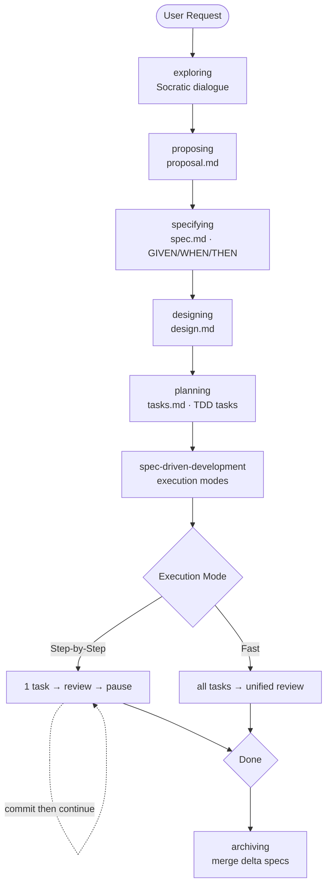
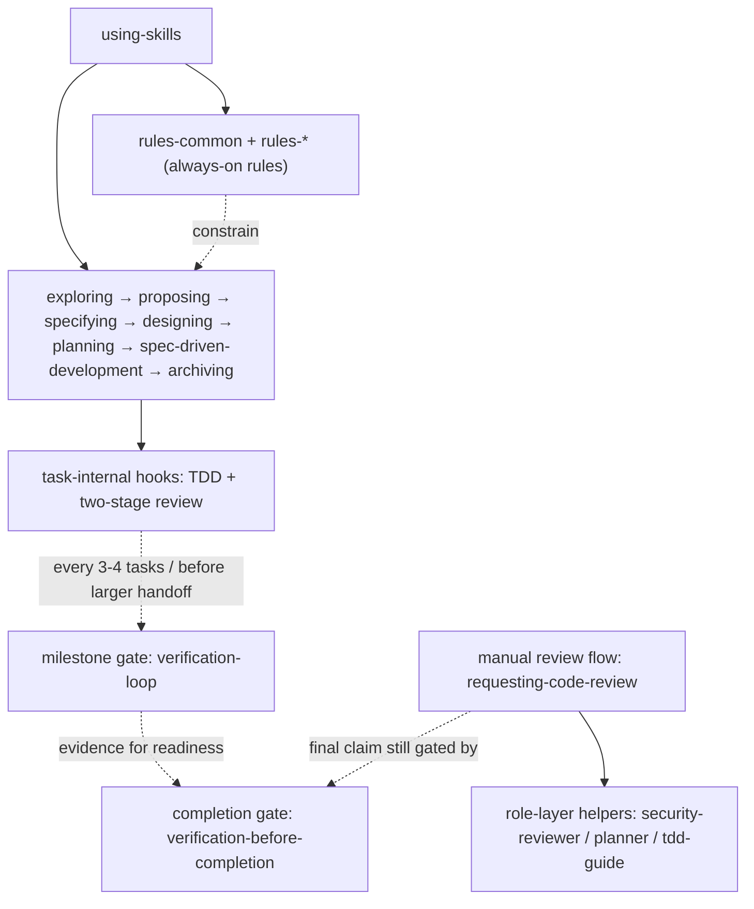

# SpecPowers

[English](README.md) | [中文](README.zh-CN.md)

> Spec-driven development workflow for AI coding assistants. Your agent thinks before it codes.

## Why

AI coding agents are fast but sloppy. They skip requirements, ignore edge cases, and write code before understanding the problem. SpecPowers fixes this by enforcing a structured workflow:

```
exploring → proposing → specifying → designing → planning → spec-driven-development → archiving
```

Every line of code traces back to a spec. Nothing is built without one.

## How It Works

```text
You: "Add dark mode to the app"

AI:  [exploring]  "System-auto-detect, manual toggle, or both?"
You: "Both"

AI:  [proposing]  → proposal.md    ✓ intent, scope, non-goals
AI:  [specifying] → spec.md        ✓ 2 requirements, 4 scenarios (GIVEN/WHEN/THEN)
AI:  [designing]  → design.md      ✓ CSS Variables, 3 files
AI:  [planning]   → tasks.md       ✓ 3 TDD tasks mapped to specs

You: "Step-by-Step"

AI:  ✅ Task 1 — RED → GREEN → Code Review: APPROVED → ⏸️ you commit
AI:  ✅ Task 2 — done → ⏸️ you commit
AI:  ✅ Task 3 — done
     🎉 All tasks complete. Say "Archive" to merge specs.
```

The agent never runs git. You review and commit after each task.
If you resume a change from an existing `tasks.md`, choose `Step-by-Step` or `Fast` before execution begins or resumes.

For complex requests, `exploring` may research existing implementations or delegate bounded research, but that stays inside `exploring` rather than becoming a separate workflow phase.



## Install

> Requires Node.js for language rule auto-install and selective install.

| Platform | Status | How to install |
|----------|--------|---------------|
| **Claude Code** | ✅ | `/plugin marketplace add NSObjects/specpowers` then `/plugin install specpowers` |
| **Codex** | ✅ | Fetch and follow instructions from `https://raw.githubusercontent.com/NSObjects/specpowers/refs/heads/main/.codex/INSTALL.md` |

For Codex local-plugin installs, bootstrap the managed skills payload once from the cloned repo before first use:

```bash
node scripts/install.js --platform codex --profile developer
```

### Language Rules

Plugin payloads are generated at install time. The `developer` profile includes `rules-common`; add language-specific rules explicitly when generating the managed payload:

```bash
node scripts/install.js --platform claude-code --profile developer --add rules-typescript
node scripts/install.js --platform codex --profile developer --add rules-python
```

At runtime, `using-skills` loads only skills that already exist in the managed plugin payload. It does not write files or auto-install rules during a chat session.

### Verify

Start a new session and say "I want to build X". The agent should begin with `exploring` — asking questions, not writing code.

## What's Included

### Workflow (the spec-driven pipeline)

| Skill | What it does |
|-------|-------------|
| `exploring` | Socratic dialogue to understand intent, with implementation research only when needed |
| `proposing` | Scope, non-goals, success criteria → proposal.md |
| `specifying` | GIVEN/WHEN/THEN behavioral specs → spec.md |
| `designing` | Architecture with trade-offs → design.md |
| `planning` | TDD task breakdown → tasks.md |
| `spec-driven-development` | Step-by-step or fast execution engine |
| `archiving` | Merge delta specs into main spec |

### Quality

| Skill | What it does |
|-------|-------------|
| `test-driven-development` | RED → GREEN → REFACTOR, no exceptions |
| `verification-loop` | 6-stage pipeline: Build → Types → Lint → Tests → Security → Diff |
| `quality-gate` | Fast lint/type checks after edits |
| `systematic-debugging` | 4-phase root cause analysis |

### Language Rules

Auto-detected from your project files. `rules-common` loads first, then language-specific rules layer on top.

TypeScript · Python · Go · Rust · Java

### Collaboration

| Skill | What it does |
|-------|-------------|
| `requesting-code-review` | Unified review entrypoint with optional deep-dive specialists |
| `receiving-code-review` | Handle review feedback |
| `dispatching-parallel-agents` | Fan out independent tasks |

### Role Agents

Pre-built agent templates: `planner` (read-only analysis), `security-reviewer` (deep-dive specialists for unified review), `tdd-guide` (TDD coaching).

### Capability Layers

- **Rules Layer** — `rules-common` and `rules-*` are standards and constraints used while writing, modifying, and reviewing code. They shape decisions and review criteria; they are not separate workflow entrypoints.
- **Workflow Layer** — user-facing entrypoints such as `requesting-code-review`, `receiving-code-review`, and `dispatching-parallel-agents`. For review, `requesting-code-review` is the single surfaced review entrypoint.
- **Role Layer** — internal helper roles such as `security-reviewer`, `planner`, and `tdd-guide`. These are internal helper roles used behind workflow skills rather than parallel user-facing workflows.

### Execution Graph



Read it as one main workflow with attached hooks:
- `using-skills` decides which workflow skill to activate first.
- `rules-common` and `rules-*` stay active as standards around the workflow, not as extra phases.
- `spec-driven-development` contains task-internal hooks such as TDD and two-stage review.
- `verification-loop` is a milestone gate, not a peer stage in the main workflow.
- `verification-before-completion` is the final claim gate before saying work is complete or ready.
- `requesting-code-review` is a separate manual review flow that can call role-layer helpers without creating extra top-level workflows.

## Design Principles

- **Specs before code** — define behavior, then implement
- **TDD is mandatory** — every task starts with a failing test
- **Evidence over claims** — prove it works before moving on
- **Research is embedded, not a phase** — investigate existing solutions inside decision-making stages instead of adding workflow branches
- **You control git** — the agent never commits; you review everything
- **Role isolation** — the AI plays a constrained role at each stage (interviewer, architect, developer…)
- **Brownfield-first** — built for existing codebases, works great for greenfield too

## Advanced: Selective Install

For fine-grained control (most users don't need this):

```bash
node scripts/install.js --platform claude-code --profile developer
node scripts/install.js --platform codex --profile developer
node scripts/install.js --platform claude-code --add rules-typescript
```

Profiles: `core` (minimal) · `developer` (recommended) · `security` · `full` (everything).

Module lifecycle commands (`list`, `doctor`, `repair`, `uninstall`) are in the `selective-install` skill.

## Contributing

Issues and PRs welcome. Keep authored skill content in `skills/`; plugin payloads are generated from the install manifest.

## Acknowledgments

Built on ideas from [OpenSpec](https://github.com/Fission-AI/OpenSpec)  and [Superpowers](https://github.com/obra/superpowers) 

## License

MIT
