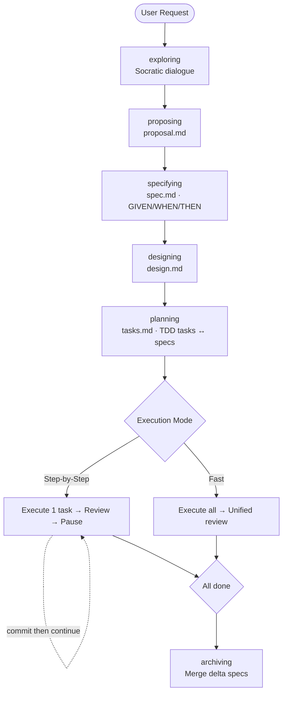

# SpecPowers

[English](README.md) | [中文](README.zh-CN.md)

Spec-driven development workflow for AI coding assistants. Your agent thinks before it codes.

Merges [OpenSpec](https://github.com/Fission-AI/OpenSpec)'s structured artifacts with [Superpowers](https://github.com/obra/superpowers)' behavioral shaping.

## What It Does

When you ask your AI agent to build something, it doesn't jump into code. Instead:

```
exploring → proposing → specifying → designing → planning → executing → archiving
```

1. **Explores** your intent through Socratic dialogue
2. **Proposes** scope, non-goals, and success criteria
3. **Specifies** testable behavior in GIVEN/WHEN/THEN format — the spine of the workflow
4. **Designs** architecture with documented trade-offs
5. **Plans** fine-grained TDD tasks, each mapped to a spec scenario
6. **Executes** with strict RED→GREEN→REFACTOR, auto code review after each task
7. **Archives** delta specs into the main specification

Every line of code traces back to a spec. Nothing is built without one.



## Quick Example

```text
You: "Add dark mode to the app"

AI:  [exploring] "System-auto-detect, manual toggle, or both?"
You: "Both"

AI:  [proposing]  → proposal.md    ✓ intent, scope, non-goals
AI:  [specifying]  → spec.md        ✓ 2 requirements, 4 scenarios
AI:  [designing]  → design.md      ✓ CSS Variables, 3 files
AI:  [planning]   → tasks.md       ✓ 3 tasks mapped to specs
     "Step-by-Step or Fast Mode?"

You: "Step-by-Step"

AI:  ✅ Task 1: Theme Context — RED → GREEN → Code Review: APPROVED
     ⏸️ "Review and commit, then say Continue"
You: "Continue"
AI:  ✅ Task 2: Toggle — done
You: "Continue"
AI:  ✅ Task 3: CSS Variables — done
     🎉 All tasks complete. Say "Archive" to merge specs.
```

## Installation

| Platform | Command |
|----------|---------|
| **Claude Code** | `/plugin install specpowers@git+https://github.com/NSObjects/specpowers` |
| **Cursor** | `/add-plugin https://github.com/NSObjects/specpowers` |
| **Gemini CLI** | `gemini extensions install https://github.com/NSObjects/specpowers` |
| **Kiro IDE** | Powers panel → Add power from GitHub → `https://github.com/NSObjects/specpowers` |
| **Codex** | Fetch and follow instructions from `https://raw.githubusercontent.com/NSObjects/specpowers/refs/heads/main/.codex/INSTALL.md` |
| **OpenCode** | Fetch and follow instructions from `https://raw.githubusercontent.com/NSObjects/specpowers/refs/heads/main/.opencode/INSTALL.md` |

**Verify:** Start a new session, say "I want to build X". The agent should start with `exploring` — asking questions, not writing code.

## Key Design Choices

**You control git.** The agent never runs git commands. It pauses after each task for you to review and commit.

**Behavioral shaping.** Every skill has Red Flags tables, Iron Laws, and rationalization defenses — hard constraints from real failure patterns, not suggestions.

**Role isolation.** The AI plays a different constrained role at each stage:

| Stage | Role | Cannot |
|-------|------|--------|
| Exploring | Interviewer | Create artifacts |
| Proposing | Product Manager | Write specs or design |
| Specifying | QA Architect | Mention implementation details |
| Designing | System Architect | Write code |
| Planning | Tech Lead | Start implementing |
| Executing | Developer | Skip TDD or modify specs |

**Dual execution mode.** Step-by-step (default): one task → review → commit → continue. Fast mode: all tasks → unified review → commit everything.

## Skills

### Core Workflow
| Skill | Purpose |
|-------|---------|
| `using-skills` | Session init and skill routing |
| `exploring` | Socratic requirement exploration |
| `proposing` | Intent and scope capture → proposal.md |
| `specifying` | Behavioral specs in GIVEN/WHEN/THEN → spec.md |
| `designing` | Architecture decisions → design.md |
| `planning` | TDD task decomposition → tasks.md |
| `spec-driven-development` | Dual-mode execution engine |
| `archiving` | Delta spec merging and history |

### Foundation (from Superpowers)
| Skill | Purpose |
|-------|---------|
| `test-driven-development` | RED-GREEN-REFACTOR iron law |
| `systematic-debugging` | 4-phase root cause analysis |
| `requesting-code-review` | Code review subagent dispatch |
| `receiving-code-review` | Handling review feedback |
| `verification-before-completion` | Evidence before claims |
| `writing-skills` | Meta-skill for creating new skills |

## Philosophy

- **Specs before code** — define behavior before implementing
- **Structured not freeform** — GIVEN/WHEN/THEN, not prose
- **Incremental not waterfall** — delta specs for existing projects
- **TDD is mandatory** — every task starts with a failing test
- **Evidence over claims** — prove it works before moving on
- **Brownfield-first** — built for existing codebases, works great for greenfield too

## License

MIT
