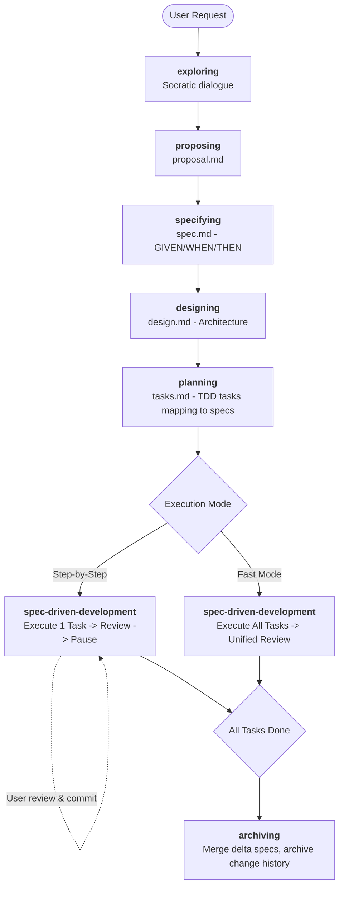

# SpecPowers

[Read in English](README.md) | [中文阅读](README.zh-CN.md)
A complete, spec-driven development workflow for AI coding assistants — built on composable skills that activate automatically.

Merges [OpenSpec](https://github.com/Fission-AI/OpenSpec)'s structured artifact system with [Superpowers](https://github.com/obra/superpowers)' behavioral shaping engine.

## How It Works

It starts the moment you fire up your coding agent. When you ask it to build something, it *doesn't* jump into writing code. Instead, it steps back and asks what you're really trying to do.

Once it understands, it writes a **proposal** — high-level intent and scope. Then it defines **behavioral specs** in structured GIVEN/WHEN/THEN format — the contract your code must fulfill. Then it designs the **technical architecture** and breaks it into **fine-grained TDD tasks**, each tracing back to a specific spec scenario.

When you say "go", your agent executes each task with strict RED-GREEN-REFACTOR discipline, auto-dispatches a **code reviewer** after completion, and pauses for you to review and commit. Or, if you're confident, run everything in fast mode.

```
Spec Scenario (GIVEN/WHEN/THEN) → Task → Failing Test → Implementation → Code Review
```

Every line of code traces back to a spec. Nothing is built without a spec, and nothing is specified without being built.

Because the skills trigger automatically, you don't need to do anything special. Your coding agent just has SpecPowers.

## Workflow Flowchart



## See It In Action (Step-by-Step Use Case)

```text
You: "Add dark mode to the app"

AI:  [exploring] Checking project structure...
     Q: "Do you want system-auto-detect, manual toggle, or both?"
You: "Both"

AI:  [proposing] → specs/changes/add-dark-mode/proposal.md
     ✓ Intent, scope, non-goals, success criteria

AI:  [specifying] → specs/changes/add-dark-mode/specs/ui/spec.md
     ✓ 2 Requirements, 4 Scenarios (GIVEN/WHEN/THEN)

AI:  [designing] → specs/changes/add-dark-mode/design.md
     ✓ CSS Variables approach, 3 files, follows existing patterns

AI:  [planning] → specs/changes/add-dark-mode/tasks.md
     ✓ 3 Tasks, each mapped to Spec Scenarios
     "Step-by-Step Mode or Fast Mode?"

You: "Step-by-Step Mode"

AI:  ✅ Task 1.1: Theme Context
     Test RED → Implement → Test GREEN → Code Review: APPROVED
     ⏸️ "Please review and commit, then say Continue"

You: [reviews, commits] "Continue"

AI:  ✅ Task 1.2: Theme Toggle — complete + reviewed
     ⏸️ "Please review and commit"

You: [reviews, commits] "Continue"

AI:  ✅ Task 1.3: CSS Variables — complete + reviewed
     🎉 All tasks done! Say "Archive" to merge specs.
```

## Detailed Workflow Breakdown

### 1. Exploring
**Skill:** `exploring`
Socratic dialogue. One question at a time. The agent understands what you're building before producing any artifacts. It detects over-scoped requests and helps decompose them into sub-projects. No code or documents are created here.

### 2. Proposing
**Skill:** `proposing`
Captures intent, scope, approach, non-goals, and success criteria in `proposal.md`. High-level — no implementation details. The "what and why", not the "how".

### 3. Specifying ← The Spine
**Skill:** `specifying`  
**This is the core innovation.** It defines testable behavior with structured scenarios:

```markdown
### Requirement: Theme Switching
The system SHALL support light and dark themes.

#### Scenario: System preference detection
- GIVEN the user has not set a manual preference
- WHEN the OS is set to dark mode
- THEN the app renders in dark theme
```

For existing projects, **Delta Specs** describe only what's changing:

```markdown
## ADDED Requirements
### Requirement: Dark Mode Support
...

## MODIFIED Requirements
### Requirement: Theme Default
(Previously: always light)
...
```

You cannot skip specifying. Every downstream artifact depends on it.

### 4. Designing
**Skill:** `designing`
Technical architecture. File-level planning with exact paths. Architecture decisions with documented trade-offs. Forces the AI to study existing codebase patterns before making decisions, ensuring isolation and preventing "god code" files.

### 5. Planning
**Skill:** `planning`
Fine-grained TDD tasks. Each task:
- Maps to specific Spec Scenarios (`Covers specs:`)
- Is completable in 5-15 minutes
- Contains actual test code and implementation code (no placeholders)
- Has dependency ordering to ensure independent compilation

### 6. Executing (Dual Mode)
**Skill:** `spec-driven-development`

| Mode | Behavior | Use when |
|------|----------|----------|
| **Step-by-Step Mode** (default) | Execute → Auto Review → Pause → You commit → Continue | Careful work, learning the codebase, high complexity tasks |
| **Fast Mode** | Execute all Tasks continuously → Unified Review → You commit everything | High confidence, simple changes, boilerplate |

In both modes, the agent strictly enforces TDD principles (`test-driven-development`) and automatically checks the code with the `code-reviewer` subagent.

### 7. Archiving
**Skill:** `archiving`
Finalizes the workflow. It merges Delta Specs into the main `specs/specs/` directory and archives the entire change folder (proposal, specs, design, tasks) to keep an immutable audit trail.

## Deep Dive: Core Features

### You Control Git
SpecPowers **never** runs git commands. No `git add`, no `git commit`, no `git push`. The agent executes a task and pauses — you review, you commit, you own the history.

### Behavioral Shaping
Every skill has **Red Flags** tables, **Iron Laws**, and **Rationalization defenses** that prevent the AI from cutting corners. These are not suggestions — they are hard constraints trained from real failure patterns.

Example from the `planning` skill:
| AI thinks... | Reality |
|--------------|---------|
| "This Task is big but it's all related" | If you can't describe it in one sentence, split it. |
| "Tests for this are obvious, no need to write them" | If they're obvious, they take 30 seconds. No excuses. |

### Role Isolation
The AI plays a different role at each stage — and is explicitly constrained to that role.

| Stage | Role | What they CAN'T do |
|-------|------|--------------------|
| Exploring | Interviewer | Create any artifacts |
| Proposing | Product Manager | Write specs or design |
| Specifying | QA Architect | Mention implementation details |
| Designing | System Architect | Write code |
| Planning | Tech Lead | Start implementing |
| Executing | Developer | Skip TDD or modify specs |

## Installation

**Note:** Installation differs by platform. Claude Code or Cursor have built-in plugin systems. Codex and OpenCode require manual setup.

### Claude Code

Install the plugin directly from the repository or local path:

```bash
/plugin install specpowers@git+https://github.com/NSObjects/specpowers
```
*(Or if running locally: `/plugin install /absolute/path/to/specpowers`)*

### Cursor

In Cursor Agent chat, load the plugin directly:

```text
/add-plugin https://github.com/NSObjects/specpowers
```

### Codex

Tell Codex:

```
Fetch and follow instructions from https://raw.githubusercontent.com/NSObjects/specpowers/refs/heads/main/.codex/INSTALL.md
```

**Detailed docs:** `.codex/INSTALL.md`

### OpenCode

Tell OpenCode:

```
Fetch and follow instructions from https://raw.githubusercontent.com/NSObjects/specpowers/refs/heads/main/.opencode/INSTALL.md
```

**Detailed docs:** `.opencode/INSTALL.md`

### Gemini CLI

```bash
gemini extensions install https://github.com/NSObjects/specpowers
```

### Verify Installation

Start a new session and tell the agent: "I want to build X". 
The agent should invoke the `exploring` skill automatically and start a dialogue. If it jumps straight to generating code or placeholders, the skills are not loaded correctly. Check `CLAUDE.md`, `GEMINI.md`, or your IDE integration.

## Complete Skill List

### Core Workflow Skills (New)
- **using-skills** — Session initialization and skill routing
- **exploring** — Socratic requirement exploration to identify scope
- **proposing** — Intent and scope capture (proposal.md)
- **specifying** — Structured behavioral specs (GIVEN/WHEN/THEN + Delta approach)
- **designing** — Architecture decisions (design.md)
- **planning** — TDD task decomposition with strict Spec-Task mapping
- **spec-driven-development** — Dual-mode execution engine enforcing Spec compliance (Step-by-Step / Fast)
- **archiving** — Delta Spec merging and change history retention

### Foundation & Debugging Skills (From Superpowers)
- **test-driven-development** — RED-GREEN-REFACTOR iron law
- **systematic-debugging** — 4-phase root cause analysis explicitly preventing random tweaks
- **requesting-code-review** — Code review dispatch subagent logic
- **receiving-code-review** — Handling AI/Human code review feedback
- **verification-before-completion** — Forwards evidence before claims
- **writing-skills** — Meta-skill for creating and tuning new skills

## Philosophy

- **Specs before code** — Define behavior before implementing it
- **Structured not freeform** — Use explicit GIVEN/WHEN/THEN, avoid abstract prose
- **Incremental not waterfall** — Delta specs are used for existing projects
- **User controls the pace** — You review, you commit, you decide when to continue execution
- **TDD is mandatory** — Every task starts with a failing test
- **Evidence over claims** — Prove it works before moving on
- **Brownfield-first** — Designed for scaling existing codebases, but perfectly robust for greenfield.

## License

MIT
