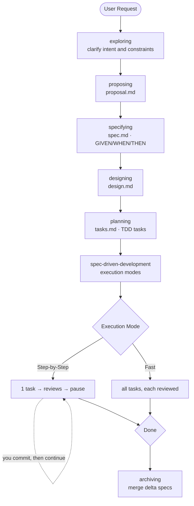
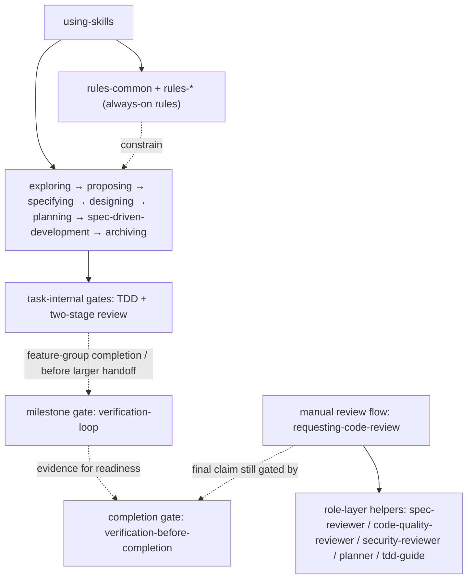

# SpecPowers

[English](README.md) | [中文](README.zh-CN.md)

> Spec-driven development workflow for AI coding assistants. SpecPowers makes the agent clarify, specify, design, plan, implement, review, and verify before it claims the work is done.

## Core Model

SpecPowers is for real project work, where AI speed is useful only when the behavior, boundaries, and evidence are clear. It gives coding agents one main path:

```text
exploring → proposing → specifying → designing → planning → spec-driven-development → archiving
```

The workflow is built around five constraints:

- Clarify intent, scope, and non-goals before changing files.
- Capture expected behavior as testable GIVEN/WHEN/THEN scenarios.
- Turn accepted design into small TDD tasks with explicit review gates.
- Tie completion, approval, and handoff claims to evidence.

Every implementation task is expected to trace back to a spec. If the expected behavior is not specified, the agent should stop and define it before coding.

## Workflow Example

```text
You: "Add dark mode to the app"

AI:  [exploring]  "System-auto-detect, manual toggle, or both?"
You: "Both"

AI:  [proposing]  → proposal.md    ✓ intent, scope, non-goals
AI:  [specifying] → spec.md        ✓ requirements and GIVEN/WHEN/THEN scenarios
AI:  [designing]  → design.md      ✓ technical approach and trade-offs
AI:  [planning]   → tasks.md       ✓ small TDD tasks mapped to specs

You: "Step-by-Step"

AI:  Task 1: RED → GREEN → Stage 1 spec review → Stage 2 code-quality review → pause for your commit
AI:  Task 2: RED → GREEN → Stage 1 spec review → Stage 2 code-quality review → pause for your commit
AI:  Final verification → completion report
```

If you resume a change from an existing `tasks.md`, choose `Step-by-Step` or `Fast` before execution begins or resumes. For complex requests, `exploring` can research existing implementations or delegate bounded research, but that stays inside `exploring` rather than becoming a separate workflow phase.



## Install

> Claude Code installs require Node.js because the managed skill payload is generated from source. Codex installs do not run the installer.

| Platform | Status | Install guide |
|----------|--------|---------------|
| **Claude Code** | Supported | [.claude-plugin/INSTALL.md](.claude-plugin/INSTALL.md) |
| **Codex** | Supported | [.codex/INSTALL.md](.codex/INSTALL.md) |

Claude Code local-plugin installs generate a managed payload once before first use:

```bash
node scripts/install.js --platform claude-code --profile developer
```

Codex plugin installs use `codex plugin marketplace` and read the plugin checkout's `skills/` directory through default plugin discovery, so they do not generate `.codex/skills/`.

Generated Claude Code plugin payloads and `manifests/install-state/` files are local install artifacts, not authored source.

### Language Rules

Claude Code plugin payloads are generated at install time. The `developer` profile includes `rules-common`; add language-specific rules explicitly when generating the managed payload. Codex reads the authored rules from the marketplace plugin checkout's `skills/` directly.

```bash
node scripts/install.js --platform claude-code --profile developer --add rules-typescript
```

At runtime, `using-skills` does not write files or install rules during a chat session.

### Verify

Start a new session and say "I want to build X". The agent should begin with `exploring`: asking clarifying questions or checking relevant context before it writes code.

## What's Included

### Workflow

| Skill | Purpose |
|-------|---------|
| `exploring` | Clarifies intent, constraints, alternatives, and existing implementation details when needed |
| `proposing` | Captures scope, non-goals, success criteria, and open questions in `proposal.md` |
| `specifying` | Defines behavior as requirements and GIVEN/WHEN/THEN scenarios in `spec.md` |
| `designing` | Records the technical approach, trade-offs, risks, and file boundaries in `design.md` |
| `planning` | Breaks the accepted design into small TDD tasks in `tasks.md` |
| `spec-driven-development` | Executes tasks in Step-by-Step or Fast mode with mandatory review gates |
| `archiving` | Merges completed delta specs back into the main spec set |

### Quality

| Skill | Purpose |
|-------|---------|
| `test-driven-development` | RED → GREEN → REFACTOR discipline for implementation tasks |
| `confidence-loop` | Evidence-bound doubt loop before approval, completion, or handoff claims |
| `verification-loop` | Build → Types → Lint → Tests → Security → Diff milestone verification |
| `quality-gate` | Fast project checks after edits |
| `verification-before-completion` | Final gate before complete, fixed, passing, approved, commit-ready, or PR-ready claims |
| `systematic-debugging` | Root-cause workflow for failures, regressions, and unexpected behavior |

### Language Rules

`rules-common` loads first when coding or reviewing code. Language-specific rules can then layer on top:

TypeScript · Python · Go · Rust · Java

### Collaboration

| Skill | Purpose |
|-------|---------|
| `requesting-code-review` | unified review entrypoint with optional deep-dive specialists |
| `receiving-code-review` | Verifies and acts on review feedback |
| `dispatching-parallel-agents` | Fans out independent workstreams when the task can be split safely |

### Internal Roles

Pre-built internal helper roles include `planner`, `spec-reviewer`, `code-quality-reviewer`, `security-reviewer`, and `tdd-guide`. They support workflow skills; they are not separate user-facing workflows.

## Capability Layers

- **Rules Layer**: `rules-common` and `rules-*` are standards and constraints used while writing, modifying, and reviewing code. They shape decisions and review criteria; they are not separate workflow entrypoints.
- **Workflow Layer**: user-facing entrypoints such as `requesting-code-review`, `receiving-code-review`, and `dispatching-parallel-agents`. For review, `requesting-code-review` is the single surfaced review entrypoint.
- **Role Layer**: internal helper roles such as `spec-reviewer`, `code-quality-reviewer`, `security-reviewer`, `planner`, and `tdd-guide`. These roles are called by workflow skills rather than exposed as parallel user-facing workflows.

### Execution Graph



Read it as one main workflow with attached gates and support roles:

- `using-skills` decides which workflow skill to activate first.
- `rules-common` and `rules-*` stay active as standards around the workflow, not as extra phases.
- `spec-driven-development` contains task-internal gates such as TDD and two-stage review. The review trigger is task completion after GREEN and before `tasks.md` is marked complete; it is not a global hook on every file edit.
- `confidence-loop` also acts as an Agent-owned post-implementation gate after the Agent completes code implementation, code modification, or an authorized bug fix. It is not a file watcher, Git hook, daemon, or runtime enforcement, and external file changes do not trigger it automatically.
- `verification-loop` is a milestone gate, not a peer stage in the main workflow.
- `verification-before-completion` is the final claim gate before saying work is complete or ready.
- `requesting-code-review` is a separate manual review flow that can call role-layer helpers without creating extra top-level workflows.

## Design Principles

- **Specs before code**: define expected behavior before implementation.
- **TDD for implementation**: each task starts with a failing test.
- **Evidence over claims**: claims of done, fixed, passing, or approved need supporting checks.
- **Research inside the workflow**: investigation happens inside the relevant stage instead of becoming a parallel process.
- **User-owned git**: the agent may inspect git state, but you manage commits and other mutations.
- **Brownfield-first**: the workflow is designed for existing repositories and still works for new projects.

## Advanced: Selective Install

Most users can stay with the `developer` profile. For finer control:

```bash
node scripts/install.js --platform claude-code --profile developer
node scripts/install.js --platform claude-code --add rules-typescript
```

Profiles: `core` (minimal) · `developer` (recommended) · `security` · `full` (everything).

Module lifecycle commands (`list`, `doctor`, `repair`, `uninstall`) are documented in the `selective-install` skill.

## Contributing

Issues and PRs are welcome. Keep authored skill content in `skills/`; generated plugin payloads come from the install manifest and local install commands.

## Acknowledgments

Built on ideas from [OpenSpec](https://github.com/Fission-AI/OpenSpec) and [Superpowers](https://github.com/obra/superpowers).

## License

MIT
