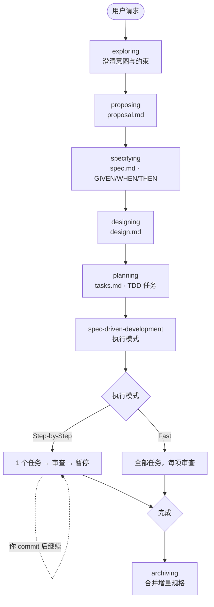
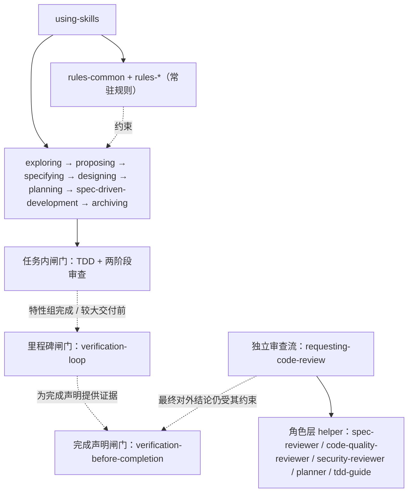

# SpecPowers

[English](README.md) | [中文](README.zh-CN.md)

> 给 AI 编程助手用的规格驱动开发工作流。SpecPowers 要求 Agent 在声明完成前完成澄清、规范、设计、规划、实现、审查和验证。

## 核心模型

SpecPowers 面向真实项目里的 AI 编程工作。AI 的速度只有在行为、边界和证据都清楚时才可靠。它给 Agent 一条主路径：

```text
exploring → proposing → specifying → designing → planning → spec-driven-development → archiving
```

这条工作流围绕五个约束设计：

- 改文件前先澄清意图、范围和非目标。
- 把预期行为写成可测试的 GIVEN/WHEN/THEN 场景。
- 把已接受设计拆成小型 TDD 任务，并设置明确审查闸门。
- 用证据支撑完成、批准和交接声明。

每个实现任务都应该能追溯到一份规格。预期行为还没有写清楚时，Agent 应该先停下来补规格，而不是直接写代码。

## 使用流程

```text
你: "给 App 加上暗黑模式"

AI:  [exploring]  "自动跟随系统、手动切换，还是都要？"
你: "都要"

AI:  [proposing]  → proposal.md    ✓ 意图、范围、非目标
AI:  [specifying] → spec.md        ✓ 需求和 GIVEN/WHEN/THEN 场景
AI:  [designing]  → design.md      ✓ 技术方案与取舍
AI:  [planning]   → tasks.md       ✓ 映射到规格的小型 TDD 任务

你: "Step-by-Step"

AI:  任务 1：RED → GREEN → Stage 1 规格审查 → Stage 2 代码质量审查 → 暂停，等你 commit
AI:  任务 2：RED → GREEN → Stage 1 规格审查 → Stage 2 代码质量审查 → 暂停，等你 commit
AI:  最终验证 → 完成报告
```

如果你是从已有 `tasks.md` 恢复执行，执行开始或恢复前，先选择 `Step-by-Step` 或 `Fast`。对于复杂需求，`exploring` 可以按需研究现有实现，或委派受限研究子任务，但这仍然属于 `exploring` 内部能力，不会变成额外流程阶段。



## 安装

> Claude Code 安装需要 Node.js，因为它会从源码生成受管技能产物。Codex 安装不运行安装器。

| 平台 | 状态 | 安装指南 |
|------|------|----------|
| **Claude Code** | 支持 | [.claude-plugin/INSTALL.md](.claude-plugin/INSTALL.md) |
| **Codex** | 支持 | [.codex/INSTALL.md](.codex/INSTALL.md) |

Claude Code 本地插件安装在首次使用前生成一次受管产物：

```bash
node scripts/install.js --platform claude-code --profile developer
```

Codex 插件安装使用 `codex plugin marketplace`，并通过默认插件发现直接读取插件检出里的 `skills/` 目录，因此不生成 `.codex/skills/`。

生成的 Claude Code 插件技能产物和 `manifests/install-state/` 状态文件属于本地安装产物，不是源码。

### 语言规则

Claude Code 插件技能产物在安装阶段生成。`developer` 配置默认包含 `rules-common`；语言特定规则需要在生成受管产物时显式加入。Codex 直接从 marketplace 插件检出的 `skills/` 读取源码规则。

```bash
node scripts/install.js --platform claude-code --profile developer --add rules-typescript
```

运行时 `using-skills` 不会在聊天会话中写文件或安装规则。

### 验证

开一个新会话，说"我想做个 X 功能"。Agent 应该从 `exploring` 开始：先问澄清问题或检查相关上下文，而不是直接写代码。

## 包含什么

### 工作流

| 技能 | 用途 |
|------|------|
| `exploring` | 澄清意图、约束、备选方案；必要时研究现有实现 |
| `proposing` | 在 `proposal.md` 中记录范围、非目标、成功标准和开放问题 |
| `specifying` | 在 `spec.md` 中把行为定义为需求和 GIVEN/WHEN/THEN 场景 |
| `designing` | 在 `design.md` 中记录技术方案、取舍、风险和文件边界 |
| `planning` | 在 `tasks.md` 中把已接受设计拆成小型 TDD 任务 |
| `spec-driven-development` | 以 Step-by-Step 或 Fast 模式执行任务，并经过强制审查闸门 |
| `archiving` | 把已完成的增量规格合并回主规格集 |

### 质量

| 技能 | 用途 |
|------|------|
| `test-driven-development` | 实现任务遵循 RED → GREEN → REFACTOR |
| `confidence-loop` | 批准、完成或交接声明前的证据边界疑点循环 |
| `verification-loop` | 构建 → 类型 → Lint → 测试 → 安全 → Diff 的里程碑验证 |
| `quality-gate` | 编辑后的快速项目检查 |
| `verification-before-completion` | complete、fixed、passing、approved、commit-ready 或 PR-ready 声明前的最终闸门 |
| `systematic-debugging` | 面向失败、回归和异常行为的根因分析流程 |

### 语言规则

写代码或审查代码时先加载 `rules-common`。随后可以叠加语言特定规则：

TypeScript · Python · Go · Rust · Java

### 协作

| 技能 | 用途 |
|------|------|
| `requesting-code-review` | 统一审查入口，可按需调用专项深审角色 |
| `receiving-code-review` | 校验并处理审查反馈 |
| `dispatching-parallel-agents` | 当任务可以安全拆分时，并行分发独立工作流 |

### 内部角色

预置内部 helper 角色包括 `planner`、`spec-reviewer`、`code-quality-reviewer`、`security-reviewer` 和 `tdd-guide`。它们支撑流程技能，不是独立的用户入口流程。

## 能力分层

- **规则层**：`rules-common` 和 `rules-*` 是写代码、改代码、review 代码时要遵守的标准与约束。它们塑造决策和审查标准，但不是新的流程入口。
- **流程层**：面向用户的入口能力，例如 `requesting-code-review`、`receiving-code-review`、`dispatching-parallel-agents`。在审查场景里，`requesting-code-review` 是唯一对外的审查入口。
- **角色层**：`spec-reviewer`、`code-quality-reviewer`、`security-reviewer`、`planner`、`tdd-guide` 这类内部协作角色。它们通过流程技能被按需调用，而不是与流程层并列的用户入口。

### 执行图



可以把它理解成“一条主流程 + 几类闸门和支撑角色”：

- `using-skills` 负责先决定当前该激活哪个流程技能。
- `rules-common` 和 `rules-*` 作为常驻标准围绕流程生效，而不是额外流程阶段。
- `spec-driven-development` 内部有任务级闸门，例如 TDD 和两阶段审查。审查触发点是任务 GREEN 之后、`tasks.md` 标记完成之前；它不是每次文件编辑后的全局 hook。
- `confidence-loop` 也是 Agent 自己完成代码实现后的门禁，适用于 Agent 完成代码实现、代码修改或已授权 bug fix 后的报告前检查。它不是文件监听、Git hook、daemon 或 runtime enforcement，外部文件变化不会自动触发它。
- `verification-loop` 是里程碑闸门，不是主流程里的平级阶段。
- `verification-before-completion` 是最终完成声明前的闸门。
- `requesting-code-review` 是独立的手动审查流，可以按需调用角色层 helper，但不会再展开成新的顶层流程。

## 设计原则

- **先规范后代码**：先定义预期行为，再实现。
- **实现任务必须 TDD**：每个任务从失败测试开始。
- **证据优于声明**：done、fixed、passing 或 approved 这类结论需要检查结果支撑。
- **研究内嵌在流程里**：调研发生在对应阶段内，而不是另起一条并行流程。
- **git 由用户掌控**：Agent 可以只读检查 git 状态，但变更操作由你处理。
- **存量项目优先**：工作流面向已有仓库设计，也适用于新项目。

## 高级：选择性安装

大多数用户使用 `developer` 配置即可。需要精细控制时可以执行：

```bash
node scripts/install.js --platform claude-code --profile developer
node scripts/install.js --platform claude-code --add rules-typescript
```

配置文件：`core`（最小）· `developer`（推荐）· `security` · `full`（全部）。

模块生命周期命令（`list`、`doctor`、`repair`、`uninstall`）在 `selective-install` 技能中说明。

## 参与贡献

欢迎提 Issue 和 PR。技能源码维护在 `skills/`；生成的插件产物来自安装 manifest 和本地安装命令。

## 致谢

设计借鉴了 [OpenSpec](https://github.com/Fission-AI/OpenSpec) 和 [Superpowers](https://github.com/obra/superpowers)。

## 开源协议

MIT
