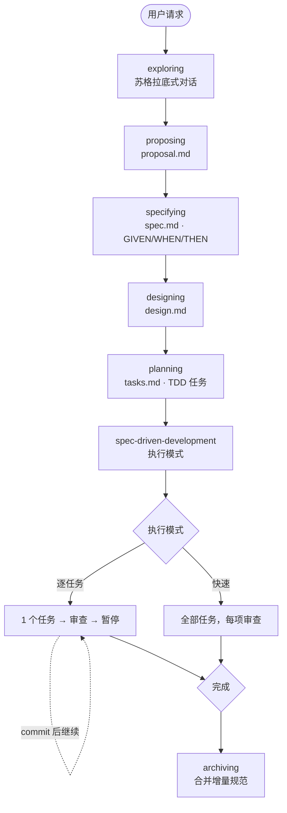
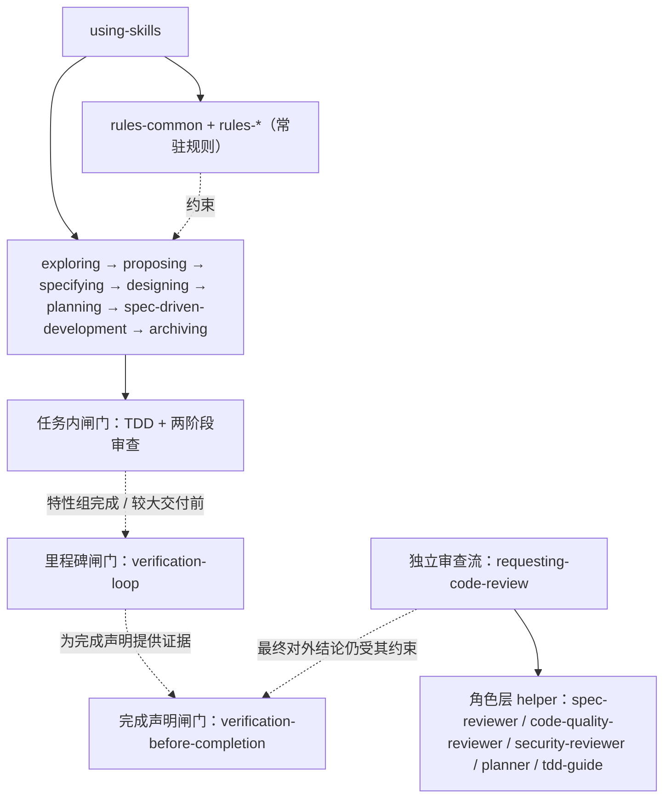

# SpecPowers

[English](README.md) | [中文](README.zh-CN.md)

> 给 AI 编程助手用的规格驱动开发工作流。让你的 AI 先想清楚再动手写代码。

## 为什么需要

AI 编程助手写代码很快，但容易跑偏——跳过需求分析、忽略边界情况、还没理解问题就开始写代码。SpecPowers 通过强制结构化工作流来解决这个问题：

```
探索 → 提案 → 规范 → 设计 → 规划 → spec-driven-development → 归档
```

每一行代码都能追溯到一份规范。没有规范，就不写代码。

## 怎么用

```text
你: "给 App 加上暗黑模式"

AI:  [exploring]  "自动跟随系统、手动切换，还是都要？"
你: "都要"

AI:  [proposing]  → proposal.md    ✓ 意图、范围、非目标
AI:  [specifying] → spec.md        ✓ 2 个需求，4 个场景 (GIVEN/WHEN/THEN)
AI:  [designing]  → design.md      ✓ CSS Variables 方案，3 个文件
AI:  [planning]   → tasks.md       ✓ 3 个 TDD 任务映射到规范

你: "逐任务"

AI:  ✅ 任务 1 — RED → GREEN → 代码审查: APPROVED → ⏸️ 你来 commit
AI:  ✅ 任务 2 — RED → GREEN → 代码审查: APPROVED → ⏸️ 你来 commit
AI:  ✅ 任务 3 — RED → GREEN → 代码审查: APPROVED
     🎉 全部完成。说 "Archive" 合并规范。
```

AI 不会执行会修改 git 状态的操作，例如 commit、reset、checkout、rebase、merge、push、stash 或 git add；只读检查如 `git status`、`git diff` 可以在有用时使用。每个任务完成后由你 review 和 commit。
如果你是从已有 `tasks.md` 恢复执行，执行开始或恢复前，先选择 `Step-by-Step` 或 `Fast`。

对于复杂需求，`exploring` 可以按需研究现有实现，或委派受限研究子任务，但这仍然属于 `exploring` 内部能力，不会变成额外流程阶段。



## 安装

> 语言规则自动安装和选择性安装功能需要 Node.js 环境。

| 平台 | 状态 | 安装方式 |
|------|------|---------|
| **Claude Code** | ✅ | 参见 [.claude-plugin/INSTALL.md](.claude-plugin/INSTALL.md) |
| **Codex** | ✅ | 参见 [.codex/INSTALL.md](.codex/INSTALL.md) |

对于 Claude Code 本地插件安装，首次使用前需执行一次物化步骤，从 `skills/` 生成受管技能产物：

```bash
node scripts/install.js --platform claude-code --profile developer
```

Codex 插件安装使用 sparse 插件检出，并通过默认插件发现直接读取该检出里的 `skills/` 目录，不生成 `.codex/skills/`。

生成的 Claude Code 插件技能产物和 `manifests/install-state/` 状态文件属于本地安装产物，不是源码。

### 语言规则

Claude Code 插件技能产物在安装阶段生成。`developer` 配置默认包含 `rules-common`；语言特定规则需要在生成受管产物时显式加入。Codex 直接从 sparse 插件检出的 `skills/` 读取源码规则。

```bash
node scripts/install.js --platform claude-code --profile developer --add rules-typescript
```

运行时 `using-skills` 不会在聊天会话中写文件或安装规则。

### 验证

开一个新会话，说"我想做个 X 功能"。AI 应该从 `exploring` 开始问你问题，而不是直接写代码。

## 包含什么

### 工作流（规格驱动管道）

| 技能 | 做什么 |
|------|--------|
| `exploring` | 苏格拉底式对话，理解意图；必要时研究现有实现 |
| `proposing` | 范围、非目标、成功标准 → proposal.md |
| `specifying` | GIVEN/WHEN/THEN 行为规范 → spec.md |
| `designing` | 架构决策与取舍 → design.md |
| `planning` | TDD 任务分解 → tasks.md |
| `spec-driven-development` | 逐任务或快速执行引擎 |
| `archiving` | 增量规范合并到主规范 |

### 质量

| 技能 | 做什么 |
|------|--------|
| `test-driven-development` | RED → GREEN → REFACTOR，没有例外 |
| `verification-loop` | 6 阶段管道：构建 → 类型 → Lint → 测试 → 安全 → Diff |
| `quality-gate` | 编辑后快速 lint/类型检查 |
| `confidence-loop` | 完成或批准声明前的证据边界疑点循环 |
| `systematic-debugging` | 四阶段根因分析 |

### 语言规则

根据项目文件自动检测。`rules-common` 先加载，语言特定规则叠加在上面。

TypeScript · Python · Go · Rust · Java

### 协作

| 技能 | 做什么 |
|------|--------|
| `requesting-code-review` | 统一审查入口，按需下钻专项深审 |
| `receiving-code-review` | 处理审查反馈 |
| `dispatching-parallel-agents` | 独立任务并行分发 |

### 角色代理

预置代理模板：`planner`（只读分析）、`spec-reviewer`（任务规范符合性审查）、`code-quality-reviewer`（任务代码质量审查）、`security-reviewer`（由统一审查按需调用的专项深审角色）、`tdd-guide`（TDD 教练）。

### 能力分层

- **规则层** — `rules-common` 和 `rules-*` 是写代码、改代码、review 代码时要遵守的标准与约束。它们塑造决策和审查标准，但不是新的流程入口。
- **流程层** — 面向用户的入口能力，例如 `requesting-code-review`、`receiving-code-review`、`dispatching-parallel-agents`。在审查场景里，`requesting-code-review` 是唯一对外的审查入口。
- **角色层** — `spec-reviewer`、`code-quality-reviewer`、`security-reviewer`、`planner`、`tdd-guide` 这类内部协作角色。它们通过流程层被按需调用，而不是与流程层并列的用户入口。

### 执行图



可以把它理解成“一条主流程 + 几类闸门和支撑角色”：
- `using-skills` 负责先决定当前该激活哪个流程技能。
- `rules-common` 和 `rules-*` 作为常驻标准围绕流程生效，而不是额外流程阶段。
- `spec-driven-development` 内部有任务级闸门，例如 TDD 和两阶段审查。审查触发点是任务 GREEN 之后、`tasks.md` 标记完成之前；它不是每次文件编辑后的全局 hook。
- `verification-loop` 是里程碑闸门，不是主流程里的平级阶段。
- `verification-before-completion` 是最终完成声明前的闸门。
- `requesting-code-review` 是独立的手动审查流，可以按需调用角色层 helper，但不会再展开成新的顶层流程。

## 设计理念

- **先规范后代码** — 先定义行为再实现
- **TDD 是强制的** — 每个任务从失败的测试开始
- **证据优于声明** — 证明能用再往下走
- **研究内嵌而非独立阶段** — 在关键决策阶段研究已有方案，而不是额外分叉一条流程
- **你掌控 git** — AI 不 commit、不修改 git 状态；只读检查允许，你 review 一切
- **角色隔离** — AI 在每个阶段扮演受限角色（采访者、架构师、开发者……）
- **存量优先** — 为已有代码库而生，新项目同样好用

## 高级：选择性安装

需要精细控制时使用（大多数用户不需要）：

```bash
node scripts/install.js --platform claude-code --profile developer
node scripts/install.js --platform claude-code --add rules-typescript
```

配置文件：`core`（最小）· `developer`（推荐）· `security` · `full`（全部）。

模块生命周期命令（`list`、`doctor`、`repair`、`uninstall`）在 `selective-install` 技能中。

## 参与贡献

欢迎提 Issue 和 PR。技能源码维护在 `skills/`，插件运行时产物从安装 manifest 生成。

## 致谢

设计借鉴了 [OpenSpec](https://github.com/Fission-AI/OpenSpec) 和 [Superpowers](https://github.com/obra/superpowers)。

## 开源协议

MIT
