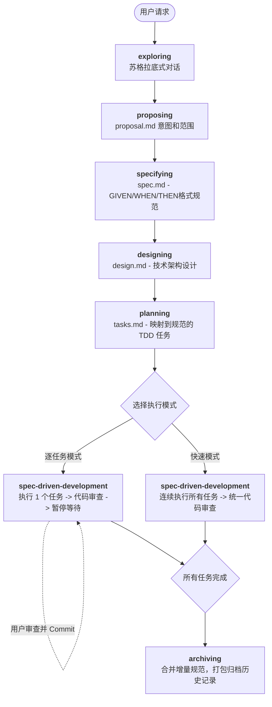

# SpecPowers

[Read in English](README.md) | [中文阅读](README.zh-CN.md)
为 AI 编程助手设计的、基于规格说明（Spec-driven）的完整开发工作流 —— 建立在可组合且自动激发的技能（Skills）之上。

本项目融合了 [OpenSpec](https://github.com/Fission-AI/OpenSpec) 的结构化工件系统与 [Superpowers](https://github.com/obra/superpowers) 的行为塑造引擎。

## 它是如何工作的

从你启动 AI 编程助手的那一刻就开始了。当你要求它构建某个功能时，它**不会**直接跳进去写代码。相反，它会退一步问你，你究竟想要做什么。

一旦它理解了你的意图，它会编写一份 **Proposal (提案)** —— 概括高层次的意图和范围。随后，它会用结构化的 GIVEN/WHEN/THEN 格式定义**行为规范 (Behavioral Specs)** —— 这是你的代码必须履行的契约。接着，它会设计**技术架构**，并将其拆解成**细粒度的 TDD (测试驱动开发) 任务**，每一个任务都能追溯到具体的规范场景。

当你说“开始”时，你的 AI 助手会以严格的 RED-GREEN-REFACTOR (红-绿-重构) 纪律执行每一项任务，完成后自动调度**代码审查员 (Code Reviewer)**，并暂停等待你进行审查和提交。或者，如果你有足够的信心，也可以让它在快速模式下一次性跑完全部流程。

```
规范场景 (GIVEN/WHEN/THEN) → 任务 → 编写失败的测试 → 编写实现 → 代码审查
```

每一行代码都可以追溯到一份规范。没有规范就不做任何构建，没有构建过的东西也不算成规范。

因为这些技能会自动触发，你不需要做任何特殊的配置。你的编程助手天然就具备了 SpecPowers。

## 工作流图解



## 实际演示 (逐任务模式示例)

```text
你: "给 App 加上暗夜模式"

AI:  [exploring 技能] 正在检查项目结构...
     问: "你希望自动跟随系统、提供手动切换开关，还是两者都要？"
你: "两者都要"

AI:  [proposing 技能] → specs/changes/add-dark-mode/proposal.md
     ✓ 已经定义: 意图，目标范围，非目标，成功标准

AI:  [specifying 技能] → specs/changes/add-dark-mode/specs/ui/spec.md
     ✓ 2 个需求，4 个具体场景 (GIVEN/WHEN/THEN)

AI:  [designing 技能] → specs/changes/add-dark-mode/design.md
     ✓ 采取 CSS Variables 方案，涉及 3 个文件，符合现有项目模式

AI:  [planning 技能] → specs/changes/add-dark-mode/tasks.md
     ✓ 3 个拆分任务，各自映射到之前的规范场景
     "你想使用 Step-by-Step Mode (逐任务模式) 还是 Fast Mode (快速模式)?"

你: "Step-by-Step Mode"

AI:  ✅ Task 1.1: 主题上下文实现
     测试失败 (RED) → 编写实现代码 → 测试通过 (GREEN) → 内部自动代码审查：批准 (APPROVED)
     ⏸️ "请 review 修改并完成 commit。准备好后请说 Continue (继续)"

你: [完成 review 和 commit] "Continue"

AI:  ✅ Task 1.2: 主题切换组件 — 完成并已审查
     ⏸️ "请 review 修改并完成 commit"

你: [完成 review 和 commit] "Continue"

AI:  ✅ Task 1.3: CSS Variables 配置 — 完成并已审查
     🎉 所有任务已结束！对我说 "Archive" (归档) 以合并这部分规范到主文件。
```

## 工作流深度拆解

### 1. Exploring (探索)
**使用技能:** `exploring`
以苏格拉底式的问答为主。每次只问一个问题。AI 助手会在产出任何工作件（Artifact）之前彻底理解你想要做什么。如果发现要求过大，它会主动识别出来，并帮你将其拆分为子项目。这一步**不会生成任何代码或者文档**。

### 2. Proposing (提案)
**使用技能:** `proposing`
将意图、工作范围、技术路径、非目标和成功标准捕捉到 `proposal.md` 中。这是高层规划——没有具体实现细节。侧重于“是什么”和“为什么”，而不是“怎么做”。

### 3. Specifying (规范定义) ← 这是核心脊柱
**使用技能:** `specifying`  
**这是本工作流的核心创新点。** 它用结构化的场景定义可供测试的行为：

```markdown
### Requirement: Theme Switching (主题切换)
The system SHALL support light and dark themes.

#### Scenario: System preference detection (系统偏好检测)
- GIVEN the user has not set a manual preference (前提：用户没有设置手动偏好)
- WHEN the OS is set to dark mode (动作：OS设为暗黑模式)
- THEN the app renders in dark theme (结果：App以暗黑主题渲染)
```

对于**已有项目（Brownfield）**，会采用**Delta Specs (增量规范)**的方式，仅描述改变的内容：

```markdown
## ADDED Requirements (新增需求)
### Requirement: Dark Mode Support
...

## MODIFIED Requirements (被修改需求)
### Requirement: Theme Default
(Previously: always light / 之前是：总是浅色)
...
```

你**绝对不能跳过** Specifying 阶段。下游的所有其他阶段和文档都依赖它。

### 4. Designing (架构设计)
**使用技能:** `designing`
负责技术架构设计、文件级的精确路径规划。包含记录了取舍原因的架构决策日志（Architecture decisions）。系统会强迫 AI 在做出决定之前先去研究已有代码库的惯例，保证代码隔离，防止产生面条式的“上帝文件 (God code)”。

### 5. Planning (任务规划)
**使用技能:** `planning`
分解为细粒度 TDD (测试驱动开发) 任务。每个任务：
- 会显式映射到刚才编写的具体规范场景 (`Covers specs:`)
- 预计可以在 5-15 分钟内完成
- 包含真实的测试代码和实现代码草稿（严禁随便写个TODO占位）
- 拥有明确的依赖顺序，保证独立编译

### 6. Executing (执行 - 提供双模)
**使用技能:** `spec-driven-development`

| 模式 | 行为特征 | 适用场景 |
|------|----------|----------|
| **逐任务模式 (默认)** | 单个任务执行 → 自动代码审查 → 暂停 → 你手工 commit → 继续 | 精细化工作、学习代码库原理、高复杂度任务 |
| **快速模式** | 连续跑完所有任务 → 统一出审查报告 → 你最后一次性 commit | 非常确定方向、简单修改、写样板代码 |

无论哪种模式，AI 助手都会严格落实 TDD 原则 (`test-driven-development`) 并通过子智能体 (`code-reviewer`) 自动审查它自己写的代码。

### 7. Archiving (归档合并)
**使用技能:** `archiving`
最后收尾阶段。它会将 Delta 增量规范正式合并入主大纲 `specs/specs/` 中，并将本次变更（Proposal、设计、各阶段产生的文档）打包含入历史归档，提供不可篡改的审查轨迹。

## 核心设计理念

### 你永远掌握 Git 的控制权
SpecPowers **永远不会**运行 git 命令。没有 `git add`, 没有 `git commit`, 也没有 `git push`。系统只运行任务并暂停 —— 由你来 review，由你来 commit，代码库的历史由你主宰。

### 行为塑造 (Behavioral Shaping)
每一项技能都有内置的 **Red Flags (红旗预警)** 表、**Iron Laws (铁律)** 和应对 **Rationalization (借口防御)** 解析，这杜绝了 AI 偷工减料的情况。这些并不是建议，而是通过大量真实错误样本训练出来的硬性约束。

例如在 `planning` (规划) 技能中：
| AI 内部常常会想... | 但实际要求是... |
|--------------|---------|
| "这个任务虽然很大，但我看内部逻辑都是一伙儿的，不用拆了" | 如果你没法用一句话说清楚它干了什么，就必须把这个任务拆掉。 |
| "这个测试很显然一定会跑通的，就不用写了吧" | 如果它"很显然"，那你花 30 秒写了怎么了。没有任何借口。 |

### 角色隔离
AI 在每个阶段扮演的角色都不同 —— 并且被严格限制在该角色的权限内。

| 阶段 | 扮演角色 | 他们绝对不能做的事情 |
|-------|------|--------------------|
| Exploring (探索) | 采访者 | 瞎造任何文件工件 |
| Proposing (提案) | 核心产品经理 | 写需求规范 (Specs) 或设计图 |
| Specifying (规范) | QA 测试架构师 | 提到了任何实现细节 |
| Designing (设计) | 系统架构师 | 开始动手写代码 |
| Planning (规划) | 研发界Tech Lead | 执行代码 |
| Executing (执行) | 开发工程师 | 跳过TDD测试或倒回去改Specs |

## 安装方式

**注意：** 不同平台的安装方式各有差异。Claude Code 和 Cursor 内置了插件平台，而 Codex 和 OpenCode 则需要你手动配置。

### Claude Code

可以直接从代码库或者本地目录安装插件：

```bash
/plugin install specpowers@git+<指向你的specpowers仓库地址>
```
*(或者如果跑在本地: `/plugin install <指向你的specpowers目录>`)*

### Cursor

在 Cursor Agent 对话框中，直接加载插件：

```text
/add-plugin <指向你的specpowers目录>
```

### Codex

告诉 Codex：

```
Fetch and follow instructions from <指向你的specpowers仓库地址>/.codex/INSTALL.md
```

**完整的设置文档详见：** `.codex/INSTALL.md`

### OpenCode

告诉 OpenCode：

```
Fetch and follow instructions from <指向你的specpowers仓库地址>/.opencode/INSTALL.md
```

**完整的设置文档详见：** `.opencode/INSTALL.md`

### Gemini CLI

```bash
gemini extensions install <指向你的specpowers目录>
```

### 验证是否安装成功

打开一个新的聊天会话并告诉 AI: "I want to build X (我想在这做个X 功能)". 
此时 AI 理应自动触发 `exploring` (探索) 技能并且开始跟你苏格拉底问答。如果它直接开始哐哐暴敲代码甚至留下一堆 TODO 占位符，那说明插件或技能加载失败了。请重新检查 `CLAUDE.md`, `GEMINI.md`, 或查阅你对应的编辑器配置方案。

## 完整技能 (Skills) 清单

### 核心工作流技能 (新开发部分)
- **using-skills** — 会话初始化引导与技能路由
- **exploring** — 苏格拉底式需求探查（防需求膨胀）
- **proposing** — 目标和非目标确定（产出 proposal.md）
- **specifying** — 结构化功能点拆解（基于 GIVEN/WHEN/THEN 与 增量 Delta 设计）
- **designing** — 技术架构定型（产出 design.md）
- **planning** — 拆分与规范绑定的精细化 TDD 任务图
- **spec-driven-development** — 双模混合核心引擎 (Step-by-step / 快速执行)
- **archiving** — 旧文件增量合并与打包归档

### 基础底座与纠错技能 (继承自 Superpowers)
- **test-driven-development** — 强制绑定执行的 RED-GREEN-REFACTOR 铁律
- **systematic-debugging** — 带有 4 个层级的根因查错，严防瞎猜改偏向
- **requesting-code-review** — 唤醒自带的代码审查子智能体逻辑层
- **receiving-code-review** — 处理人工及AI反馈闭环
- **verification-before-completion** — “要证明、不要口头说好”的工作验收确认
- **writing-skills** — 生成修改其他技能或其本身的 Meta 技能。

## 我们的哲学 (Philosophy)

- **Specs before code (以规构码)** — 在动手前先定规矩
- **Structured not freeform (以理而非感性)** — 使用显式的 GIVEN/WHEN/THEN，摒弃长篇大论
- **Incremental not waterfall (小步迭代不走瀑布)** — 旧项目使用增量 (Delta Specs) 以控制风险
- **User controls the pace (用户掌控节奏)** — 你审查、你提交、你的仓库你说了算
- **TDD is mandatory (绝对的 TDD)** — 不写个挂掉的 test 就坚决不动手
- **Evidence over claims (拿事实说话，拒绝瞎编)** — 除非证明管用了，否则绝对别跳下一步
- **Brownfield-first (优先处理屎山)** — 为旧项目而生，但在绿油油的草地代码 (Greenfield) 跑起来同样生猛

## 开源协议

MIT
