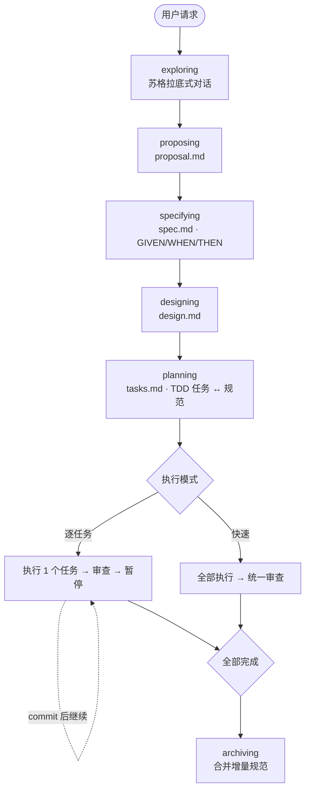

# SpecPowers

[English](README.md) | [中文](README.zh-CN.md)

给 AI 编程助手用的规格驱动开发工作流。让你的 AI 先想清楚再动手写代码。

## 它做什么

当你让 AI 助手构建功能时，它不会直接写代码，而是：

```
探索 → 提案 → 规范定义 → 架构设计 → 任务规划 → 执行 → 归档
```

1. **探索 (exploring)** — 苏格拉底式问答，理解你真正想要什么
2. **提案 (proposing)** — 确定范围、非目标和成功标准
3. **规范 (specifying)** — 用 GIVEN/WHEN/THEN 定义可测试的行为——整个工作流的脊柱
4. **设计 (designing)** — 技术架构决策，附带取舍记录
5. **规划 (planning)** — 细粒度 TDD 任务，每个任务都映射到规范场景
6. **执行 (executing)** — 严格遵循 RED→GREEN→REFACTOR，每个任务完成后自动代码审查
7. **归档 (archiving)** — 将增量规范合并到主规范

每一行代码都能追溯到一份规范。没有规范，就不写代码。



## 快速示例

```text
你: "给 App 加上暗黑模式"

AI:  [exploring]  "自动跟随系统、手动切换，还是都要？"
你: "都要"

AI:  [proposing]  → proposal.md    ✓ 意图、范围、非目标
AI:  [specifying] → spec.md        ✓ 2 个需求，4 个场景
AI:  [designing]  → design.md      ✓ CSS Variables 方案，3 个文件
AI:  [planning]   → tasks.md       ✓ 3 个任务映射到规范
     "逐任务模式还是快速模式？"

你: "逐任务"

AI:  ✅ 任务 1: 主题上下文 — RED → GREEN → 代码审查: APPROVED
     ⏸️ "请 review 并 commit，然后说 Continue"
你: "Continue"
AI:  ✅ 任务 2: 切换组件 — 完成
你: "Continue"
AI:  ✅ 任务 3: CSS Variables — 完成
     🎉 全部完成。说 "Archive" 合并规范。
```

## 安装

### 支持平台

| 平台 | 安装方式 |
|------|---------|
| **Claude Code** | 步骤 1: `/plugin marketplace add NSObjects/specpowers` <br> 步骤 2: `/plugin install specpowers` |
| **Cursor** | `/add-plugin https://github.com/NSObjects/specpowers` |
| **Gemini CLI** | `gemini extensions install https://github.com/NSObjects/specpowers` |
| **Kiro IDE** | Powers 面板 → Add power from GitHub → `https://github.com/NSObjects/specpowers` |
| **Codex** | 获取并按照说明操作 `https://raw.githubusercontent.com/NSObjects/specpowers/refs/heads/main/.codex/INSTALL.md` |
| **OpenCode** | 获取并按照说明操作 `https://raw.githubusercontent.com/NSObjects/specpowers/refs/heads/main/.opencode/INSTALL.md` |

### 验证安装

开一个新会话，说"我想做个 X 功能"。AI 应该从 `exploring` 开始问你问题，而不是直接写代码。

## 核心设计

### 你掌控 Git

AI 永远不会执行 git 命令。每个任务完成后暂停，由你 review 和 commit。

### 行为塑造

每个技能都包含红旗预警表、铁律和合理化防御——这些是从真实失败模式中提炼的硬约束，不是建议。

### 角色隔离

AI 在每个阶段扮演不同的受限角色：

| 阶段 | 角色 | 不能做 |
|------|------|--------|
| 探索 | 采访者 | 创建任何文件 |
| 提案 | 产品经理 | 写规范或设计 |
| 规范 | QA 架构师 | 提及实现细节 |
| 设计 | 系统架构师 | 写代码 |
| 规划 | Tech Lead | 开始实现 |
| 执行 | 开发工程师 | 跳过 TDD 或修改规范 |

### 双执行模式

- **逐任务模式**（默认）：一个任务 → 审查 → commit → 继续
- **快速模式**：全部任务 → 统一审查 → 一次性 commit

## 技能列表

### 核心工作流

| 技能 | 用途 |
|------|------|
| `using-skills` | 会话初始化与技能路由 |
| `exploring` | 苏格拉底式需求探索 |
| `proposing` | 意图与范围捕获 → proposal.md |
| `specifying` | GIVEN/WHEN/THEN 行为规范 → spec.md |
| `designing` | 架构决策 → design.md |
| `planning` | TDD 任务分解 → tasks.md |
| `spec-driven-development` | 双模执行引擎 |
| `archiving` | 增量规范合并与归档 |

### 基础能力

| 技能 | 用途 |
|------|------|
| `test-driven-development` | RED-GREEN-REFACTOR 铁律 |
| `systematic-debugging` | 四阶段根因分析 |
| `dispatching-parallel-agents` | 独立问题并行代理调度 |
| `requesting-code-review` | 代码审查子代理调度 |
| `receiving-code-review` | 处理审查反馈 |
| `verification-before-completion` | 拿证据说话 |
| `writing-skills` | 创建新技能的元技能 |

## 设计理念

- **先规范后代码** — 先定义行为再实现
- **结构化而非散文** — GIVEN/WHEN/THEN，不是长篇大论
- **增量而非瀑布** — 已有项目用增量规范
- **TDD 是强制的** — 每个任务从失败的测试开始
- **证据优于声明** — 证明能用再往下走
- **存量优先** — 为已有代码库而生，新项目同样好用

## 开源协议

MIT
