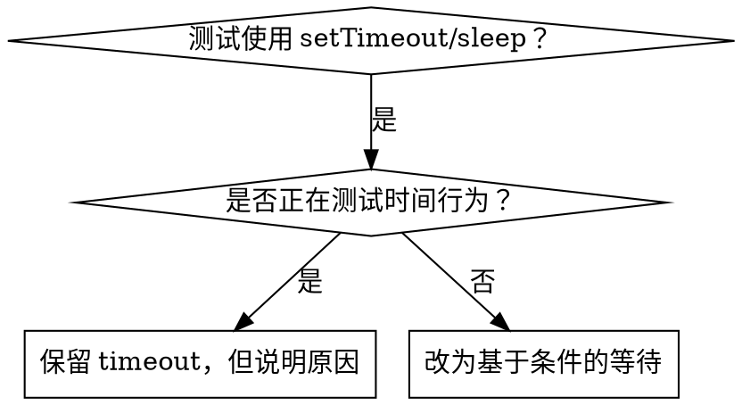

# 基于条件的等待（Condition-Based Waiting）

## 概览

Flaky test 经常来自对时间的猜测：`setTimeout`、`sleep` 或固定延迟在本地机器上可能通过，但在 CI、并发、负载较高或慢机器上失败。

**核心原则：** 等待真正关心的条件成立，而不是猜它需要多久。

## 使用时机



适用于：

- 测试中有任意延迟，例如 `setTimeout`、`sleep`、`time.sleep()`；
- 测试有时通过、有时失败；
- 并行运行或 CI 中超时；
- 等待异步操作完成；
- 等待事件、状态、文件、队列、网络响应或后台任务完成。

不适用于：

- 正在测试真实时间行为，例如 debounce、throttle、interval、超时逻辑；
- 业务要求必须等待一段已知时间。

如果必须使用固定延迟，必须写清楚为什么它是业务时间要求，而不是猜测。

## 核心模式

```typescript
// ❌ 修改前：猜测异步操作 50ms 后完成
await new Promise(resolve => setTimeout(resolve, 50));
const result = getResult();
expect(result).toBeDefined();

// ✅ 修改后：等待真正关心的条件成立
const result = await waitFor(
  () => getResult(),
  'result becomes available'
);
expect(result).toBeDefined();
```

## 常用模式

| 场景 | 模式 |
|---|---|
| 等待事件 | `waitFor(() => events.find(event => event.type === 'DONE'), 'DONE event')` |
| 等待状态 | `waitFor(() => machine.state === 'ready', 'machine ready')` |
| 等待数量 | `waitFor(() => items.length >= 5, 'at least 5 items')` |
| 等待文件 | `waitFor(() => fs.existsSync(path), 'file exists')` |
| 等待复杂条件 | `waitFor(() => obj.ready && obj.value > 10, 'object ready with value')` |
| 等待特定结果 | `waitFor(() => queue.find(item => item.id === targetId), 'target item in queue')` |

## 通用实现

```typescript
async function waitFor<T>(
  condition: () => T | undefined | null | false,
  description: string,
  timeoutMs = 5000,
  intervalMs = 10
): Promise<T> {
  const startTime = Date.now();

  while (true) {
    const result = condition();
    if (result) return result;

    const elapsedMs = Date.now() - startTime;
    if (elapsedMs > timeoutMs) {
      throw new Error(
        `Timeout waiting for ${description} after ${timeoutMs}ms`
      );
    }

    await new Promise(resolve => setTimeout(resolve, intervalMs));
  }
}
```

实现要求：

- 必须有 timeout，避免无限等待。
- timeout 错误必须包含等待条件描述。
- 每次循环都重新读取最新状态，不要读取缓存值。
- 轮询间隔通常为 10–50ms；过快浪费 CPU，过慢拖慢测试。
- 条件函数不要产生副作用；它应该只读取状态。

完整项目中可以封装领域专用 helper，例如 `waitForEvent`、`waitForEventCount`、`waitForEventMatch`。

## 常见错误

### 错误 1：轮询过快

```typescript
setTimeout(check, 1); // ❌ 浪费 CPU，CI 中可能更不稳定
```

改为：

```typescript
await new Promise(resolve => setTimeout(resolve, 10)); // ✅ 合理轮询间隔
```

### 错误 2：没有 timeout

```typescript
while (!isReady()) {
  await sleep(10); // ❌ 条件永远不成立时会卡死
}
```

改为：始终设置 timeout，并在错误中说明等待的条件。

### 错误 3：读取了陈旧状态

```typescript
const state = machine.state;
await waitFor(() => state === 'ready', 'machine ready'); // ❌ state 不会更新
```

改为：

```typescript
await waitFor(() => machine.state === 'ready', 'machine ready'); // ✅ 每次读取最新状态
```

### 错误 4：等待条件太模糊

```typescript
await waitFor(() => events.length > 0, 'some event'); // ❌ 任何事件都可能满足
```

改为：

```typescript
await waitFor(
  () => events.find(event => event.type === 'TOOL_FINISHED'),
  'TOOL_FINISHED event'
); // ✅ 等待目标事件
```

## 什么时候固定 timeout 是正确的

固定 timeout 只有在**测试的就是时间行为**时才合理。例如工具每 100ms 产生一次 tick，需要等待两个 tick 来验证中间输出。

```typescript
await waitForEvent(manager, 'TOOL_STARTED'); // 先等待触发条件
await new Promise(resolve => setTimeout(resolve, 200)); // 再等待已知时间行为
// 200ms = 2 个 100ms tick；这里测试的是部分输出的时间行为
```

使用固定 timeout 的要求：

1. 先等待触发条件成立；
2. 延迟基于已知业务时间，而不是猜测；
3. 注释解释为什么必须等待这段时间；
4. timeout 值应尽量小，但足以覆盖被测试的时间窗口。

## 重构任意 sleep 的步骤

1. 找到 sleep 后面第一个断言。
2. 问：这个断言真正需要什么条件成立？
3. 把该条件写成可轮询的读取函数。
4. 用 `waitFor` 等待该条件。
5. 保留原断言，确保测试语义没有变弱。
6. 在 CI 或并行模式下运行，确认不再 flaky。

## 完成标准

基于条件的等待完成时，应该满足：

- 测试不再依赖机器速度或负载；
- 失败时错误信息说明等待的具体条件；
- 没有无限等待；
- 没有过快轮询；
- 没有等待无关事件；
- 固定 timeout 只保留在真正测试时间行为的地方，并且有注释说明。

## 真实影响

一次实际调试会话中的结果：

- 修复 3 个文件中的 15 个 flaky tests；
- 通过率从 60% 提升到 100%；
- 执行时间减少约 40%；
- 消除了由竞态条件导致的随机失败。
