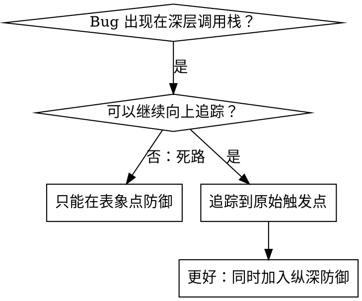
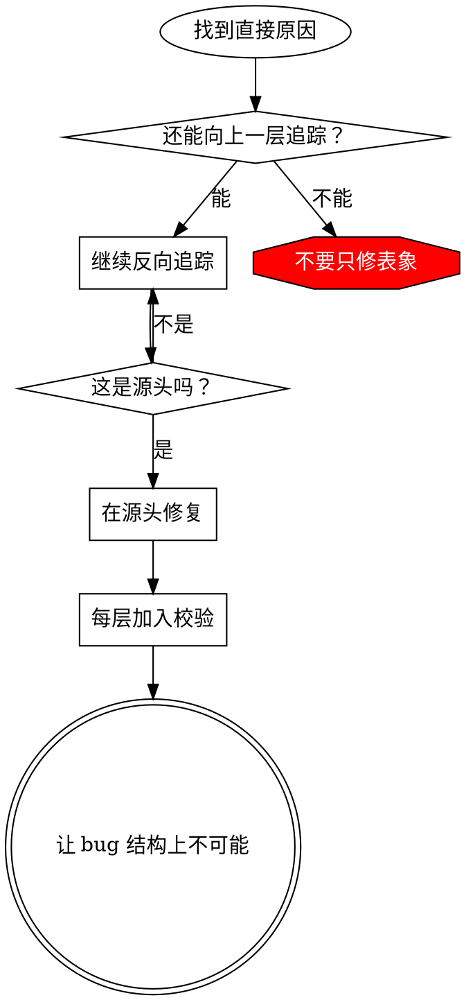

# 根因追踪（Root Cause Tracing）

## 概览

Bug 经常表现为深层调用栈中的错误，例如在错误目录执行 `git init`、文件被创建到错误位置、数据库用错误路径打开。直觉通常会让你在报错位置修复，但那往往只是处理表象。

**核心原则：** 沿调用链反向追踪，直到找到最初触发点；在源头修复，而不是在报错点打补丁。

## 使用时机



适用于：

- 错误发生在执行深处，而不是入口处；
- stack trace 显示很长的调用链；
- 不清楚无效数据从哪里来；
- 需要确认是哪一个测试、输入或代码路径触发问题；
- 当前报错位置看起来“很容易修”，但无法解释为什么会走到那里。

## 追踪流程

### 1. 观察表象

先准确描述失败，而不是立刻解释失败。

```text
Error: git init failed in /Users/jesse/project/packages/core
```

记录：

- 报错操作；
- 报错位置；
- 关键参数；
- 当前工作目录；
- 环境变量；
- 测试名或请求入口。

### 2. 找直接原因

问：**哪一行代码直接导致了这个表象？**

```typescript
await execFileAsync('git', ['init'], { cwd: projectDir });
```

直接原因只解释“这里为什么报错”，通常还不是根因。

### 3. 继续问：谁调用了这里？

沿调用链向上追踪：

```text
WorktreeManager.createSessionWorktree(projectDir, sessionId)
  → 被 Session.initializeWorkspace() 调用
  → 被 Session.create() 调用
  → 被 Project.create() 测试路径触发
```

每上一层都要问：

- 当前层传入了什么值？
- 当前层是否应该验证这个值？
- 当前层为什么会允许坏值继续向下流动？

### 4. 追踪传入值

问：**坏值是什么？它何时变坏？**

示例：

- `projectDir = ''`，是空字符串。
- 空字符串作为 `cwd` 时会解析为 `process.cwd()`。
- 因此 `git init` 被执行在源码目录中。

这解释了表象，但仍需要找到空字符串的来源。

### 5. 找到原始触发点

问：**空字符串从哪里来？为什么在那里产生？**

```typescript
const context = setupCoreTest(); // 初始返回 { tempDir: '' }
Project.create('name', context.tempDir); // beforeEach 之前访问了 tempDir
```

此时根因是：测试在 `beforeEach` 初始化前读取了顶层变量，导致空值流入真实业务路径。

## 追踪记录表

调查过程中使用这个表，避免跳层猜测：

| 层级 | 当前函数/组件 | 收到的值 | 直接证据 | 下一步追踪 |
|---|---|---|---|---|
| 1 | `gitInit` | `directory = ''` | 日志/stack trace | 谁传入了 `directory`？ |
| 2 | `createSessionWorktree` | `projectDir = ''` | 调用参数 | 谁调用了它？ |
| 3 | `Session.create` | `context.tempDir = ''` | 测试代码 | 何时初始化 `tempDir`？ |
| 4 | `setupCoreTest` | 初始空值 | beforeEach 时序 | 修复源头访问方式 |

只有当表格能解释坏值如何从源头流到报错点时，才算找到根因。

## 添加 stack trace 诊断

无法手动追踪时，添加临时诊断信息。诊断应放在危险操作之前，而不是失败之后。

```typescript
async function gitInit(directory: string) {
  const stack = new Error().stack;
  console.error('DEBUG git init:', {
    directory,
    cwd: process.cwd(),
    nodeEnv: process.env.NODE_ENV,
    stack,
  });

  await execFileAsync('git', ['init'], { cwd: directory });
}
```

关键要求：

- 测试中优先用 `console.error()`，不要依赖可能被测试框架屏蔽的 logger。
- 在危险操作前记录，不要等失败后才记录。
- 记录值、当前目录、环境、时间戳和 stack trace。
- 不记录 secret、token、密码或隐私数据。

运行并捕获：

```bash
npm test 2>&1 | grep 'DEBUG git init'
```

分析 stack trace 时寻找：

- 哪个测试文件触发；
- 哪一行触发；
- 是否同一个参数反复异常；
- 是否只有某个测试顺序或并发模式下触发。

## 找出污染测试

如果测试运行后出现意外副作用，但不知道哪个测试制造了污染，例如源码目录被创建了 `.git`，可以使用二分脚本定位污染源：

```bash
./find-polluter.sh '.git' 'src/**/*.test.ts'
```

策略：逐个或二分运行测试，检查污染物是否出现，定位第一个制造污染的测试。

如果没有现成脚本，自己实现时也遵循同样原则：

1. 定义污染物或错误状态；
2. 在每个测试后检查；
3. 找到第一个产生污染的测试；
4. 再对该测试做调用链追踪。

## 真实示例：空 `projectDir`

**表象：** `.git` 被创建在 `packages/core/` 源码目录中。

**追踪链：**

1. `git init` 在 `process.cwd()` 执行，因为 `cwd` 参数为空。
2. `WorktreeManager` 收到了空 `projectDir`。
3. `Session.create()` 传入了空字符串。
4. 测试在 `beforeEach` 前访问了 `context.tempDir`。
5. `setupCoreTest()` 初始返回 `{ tempDir: '' }`。

**根因：** 顶层变量初始化时读取了尚未初始化的值。

**源头修复：** 将 `tempDir` 改为 getter；如果在 `beforeEach` 初始化前访问，则立即抛出清晰错误。

**同时加入纵深防御：**

- 第 1 层：`Project.create()` 校验目录有效性。
- 第 2 层：`WorkspaceManager` 校验 `projectDir` 非空。
- 第 3 层：测试环境中禁止在临时目录外执行 `git init`。
- 第 4 层：`git init` 前记录 stack trace，便于后续取证。

## 关键原则



不要只修错误出现的位置。必须追踪到原始触发点。

## Stack trace 技巧

- **测试中：** 用 `console.error()`，因为 logger 可能被测试框架吞掉。
- **操作前：** 在危险操作之前打日志。
- **上下文：** 包含目录、`cwd`、环境变量、关键参数和时间戳。
- **调用链：** `new Error().stack` 能展示完整调用路径。
- **隐私：** 不输出 secret、token、密码或用户隐私数据。

## 判断是否已经找到根因

找到根因时，你应该能解释完整链路：

```text
原始触发点 → 坏值产生 → 坏值传播 → 缺失校验 → 危险操作 → 失败表象
```

如果只能解释最后两步，说明仍然只找到了直接原因，没有找到根因。

## 真实影响

一次实际调试会话中的结果：

- 通过 5 层反向追踪找到根因；
- 在源头修复；
- 增加 4 层纵深防御；
- 1847 个测试通过；
- 没有再污染源码目录。
