# Test-Driven Development (TDD)（测试驱动开发）

## Overview（概览）

先写 test。看它失败。再写最小 code 让它通过。然后只在 green 状态下重构。

**核心原则：** 如果没有看见 test 因正确原因失败，就不知道它是否真的测试了目标行为。

**违反规则的字面要求，就是违反规则精神。**

## When to Use（使用时机）

**始终使用：**

- New features
- Bug fixes
- Refactoring
- Behavior changes
- Public API changes
- Error-handling changes

**例外情况需要询问用户或上层 workflow：**

- Throwaway prototypes
- Generated code
- Configuration-only changes
- Documentation-only changes

如果你在想 “skip TDD just this once”，停下。这是 rationalization。

## Mandatory Pre-RED Rule Loading Gate（写 RED 之前的强制规则门禁）

写任何 test 之前，必须完成这个 gate。这个 gate 是 TDD 的一部分，不是可选准备工作。

```
BEFORE RED TEST:
  1. Load rules-common.
  2. From rules-common, determine the exact language-specific rule to load.
  3. Load the corresponding rules-{language} skill/file.
  4. Extract test conventions from rules-common and rules-{language}.
  5. Load testing-anti-patterns.md when writing/changing tests, adding mocks,
     or considering test-only production methods.
  6. Only then write the RED test.
```

### Language Rule Resolution（语言规则解析）

不要直接凭文件扩展名或个人经验跳到 `rules-{language}`。必须先读取 `rules-common`，再按其中定义的路由、命名、语言识别或优先级规则确定目标语言规则。

例如：

- Go project → 先读 `rules-common` → 得到/确认 `rules-golang` → 再写 Go tests。
- TypeScript project → 先读 `rules-common` → 得到/确认 `rules-typescript` → 再写 TS tests。
- Python project → 先读 `rules-common` → 得到/确认 `rules-python` → 再写 Python tests。

如果 `rules-common` 没有明确映射，再根据项目 primary language、测试框架、已有测试约定进行 fallback 判断；但 fallback 不能跳过 `rules-common`。

### Hard Blockers（硬性阻断）

以下情况禁止继续写 RED test：

- 未加载 `rules-common`。
- 未根据 `rules-common` 获取或确认对应 `rules-{language}`。
- 未加载对应语言规则。
- 未确认当前测试框架、命名约定、fixture/helper 约定。
- 使用 mock 前未检查 `testing-anti-patterns.md` 的 mock gate。

如果已经在完成 gate 之前写了 test，删除或重写该 test。不能把它当作 reference 继续 adapt。

## Rule Precedence（规则优先级）

1. 用户显式指令。
2. 当前 workflow / task 指令。
3. `rules-common`。
4. `rules-{language}`。
5. `testing-anti-patterns.md`。
6. 本 TDD skill 的通用建议。

Language-specific rules 定义 test conventions，例如 table-driven tests、naming patterns、framework choices、assertion style、fixture layout。它们必须遵守，但不能替代 `rules-common` baseline。

## The Iron Law（铁律）

```
NO PRODUCTION CODE WITHOUT A FAILING TEST FIRST
```

如果先写了 production code，再写 test，删除 production code，从 test 重新开始。

**没有例外：**

- 不把提前写出的 code 留作 “reference”。
- 不在写 tests 时 “adapt” 已有实现。
- 不偷看实现来反推测试。
- Delete means delete。

从 tests 重新实现。就是这样。

## TDD Cycle（TDD 循环）

```dot
digraph tdd_cycle {
    rankdir=LR;
    gate [label="RULE GATE\nrules-common → rules-{language}\nanti-patterns", shape=box, style=filled, fillcolor="#fff2cc"];
    red [label="RED\nWrite failing test", shape=box, style=filled, fillcolor="#ffcccc"];
    verify_red [label="Verify fails\ncorrectly", shape=diamond];
    green [label="GREEN\nMinimal code", shape=box, style=filled, fillcolor="#ccffcc"];
    verify_green [label="Verify passes\nAll green", shape=diamond];
    refactor [label="REFACTOR\nClean up", shape=box, style=filled, fillcolor="#ccccff"];
    next [label="Next behavior", shape=ellipse];

    gate -> red;
    red -> verify_red;
    verify_red -> green [label="yes"];
    verify_red -> red [label="wrong failure"];
    green -> verify_green;
    verify_green -> refactor [label="yes"];
    verify_green -> green [label="no"];
    refactor -> verify_green [label="stay green"];
    verify_green -> next;
    next -> gate;
}
```



## RED - Write a Failing Test（写失败测试）

在完成 rule gate 后，写一个 minimal test，展示应该发生什么。

**要求：**

- One behavior only。
- Clear behavior name。
- 使用当前语言规则要求的测试风格。
- 优先测试真实 behavior，而不是 mock behavior。
- 除非不可避免，否则不用 mocks。
- 不为了测试而向 production class 添加 test-only methods。
- Typed language 中，缺少目标 API 导致的 compile/type failure 可以是有效 RED；typo、错误 import、错误签名、误解现有 API 不是有效 RED。

<Good>

```typescript
test('retries failed operations until the third attempt succeeds', async () => {
  let attempts = 0;
  const operation = async () => {
    attempts++;
    if (attempts < 3) throw new Error('fail');
    return 'success';
  };

  const result = await retryOperation(operation);

  expect(result).toBe('success');
  expect(attempts).toBe(3);
});
```

名称清楚，测试真实 behavior，只测一件事。
</Good>

<Bad>

```typescript
test('retry works', async () => {
  const mock = jest.fn()
    .mockRejectedValueOnce(new Error())
    .mockRejectedValueOnce(new Error())
    .mockResolvedValueOnce('success');

  await retryOperation(mock);

  expect(mock).toHaveBeenCalledTimes(3);
});
```

名称含糊，主要验证 mock 调用次数，而不是用户可观察 behavior。
</Bad>

## Verify RED - Watch It Fail（确认 RED）

**强制执行，不要跳过。**

运行最小相关测试集，例如：

```bash
npm test path/to/test.test.ts
```

或使用 `rules-{language}` 指定的命令。

确认：

- Test fails，而不是测试环境 error。
- Failure message 符合预期。
- 失败原因是 behavior missing。
- 不是 typo、错误 import、错误 fixture、错误 mock、错误测试框架用法。

**Test passes?** 你在测试 existing behavior。修正 test。

**Test errors?** 修正测试错误，重跑直到它因正确原因失败。

**Typed language compile/type failure?** 只有当 failure 来自“目标 API/behavior 尚未实现”时才算 RED；如果来自拼写、导入、签名或测试写法错误，不算。

## GREEN - Minimal Code（最小实现）

写能让当前 failing test 通过的最简单 production code。

<Good>

```typescript
async function retryOperation<T>(fn: () => Promise<T>): Promise<T> {
  for (let i = 0; i < 3; i++) {
    try {
      return await fn();
    } catch (e) {
      if (i === 2) throw e;
    }
  }
  throw new Error('unreachable');
}
```

刚好足以通过。
</Good>

<Bad>

```typescript
async function retryOperation<T>(
  fn: () => Promise<T>,
  options?: {
    maxRetries?: number;
    backoff?: 'linear' | 'exponential';
    onRetry?: (attempt: number) => void;
  }
): Promise<T> {
  // YAGNI
}
```

过度工程化。
</Bad>

不要添加 features、refactor unrelated code，或超出 test 去 “improve”。

## Verify GREEN - Watch It Pass（确认 GREEN）

**强制执行。**

运行：

1. 当前最小相关测试。
2. 受影响 package/module 的测试。
3. `rules-{language}` 要求的 lint/typecheck/static checks。

确认：

- 当前 test passes。
- Existing tests still pass。
- Output pristine，没有 unexpected errors/warnings。

**Test fails?** 修 code，不修 test，除非 test 的需求表达确实错了。

**Other tests fail?** 现在修。

## REFACTOR - Clean Up（重构清理）

只能在 green 后：

- Remove duplication。
- Improve names。
- Extract helpers。
- Simplify design。
- Align code with `rules-common` and `rules-{language}`。

保持 tests green。不添加新 behavior。

## Repeat（重复）

为下一个 behavior 重新进入 gate，并写下一个 failing test。一个 TDD cycle 只推进一个小行为。

## Good Tests（好测试）

| Quality | Good | Bad |
|---------|------|-----|
| **Minimal** | 一次一件事。Name 里有 “and”？拆开。 | `test('validates email and domain and whitespace')` |
| **Clear** | Name 描述 behavior。 | `test('test1')` |
| **Behavioral** | 验证用户/调用方可观察结果。 | 验证 private implementation 或 mock existence。 |
| **Rule-aligned** | 遵守 `rules-{language}` 的测试约定。 | 套用别的语言/项目的习惯。 |
| **Robust** | 对重构稳定。 | 对内部调用顺序过度敏感。 |

## Mocking Gate（Mock 门禁）

写 mock 前必须加载并遵守 `testing-anti-patterns.md`。

```
BEFORE MOCKING:
  1. What external cost or nondeterminism requires this mock?
  2. What side effects does the real dependency have?
  3. Does this test depend on those side effects?
  4. Can we mock at a lower level instead?
  5. Does the mock mirror the real API/data shape completely enough?
```

如果答不出来，不要 mock。优先用 real dependency、fake、fixture、test container、in-memory implementation，或更低层的 test double。

禁止：

- Assert on `*-mock` test IDs。
- 测试 mock 是否存在。
- 因为 “safe” 或 “maybe slow” 而 mock。
- 创建不完整 response mock。
- 为 cleanup 给 production class 添加 test-only methods。

## Why Order Matters（为什么顺序重要）

**"I'll write tests after to verify it works"**

Code 写完后再写的 tests 会立刻通过。立刻通过什么也证明不了：

- 可能测试了 wrong thing。
- 可能测试 implementation，而不是 behavior。
- 可能漏掉你忘记的 edge cases。
- 你从未见过它捕捉 bug。

Tests-first 强迫你在实现前定义行为，并证明 test 能失败。

**"I already manually tested all the edge cases"**

Manual testing 是 ad-hoc：

- 没有记录测了什么。
- Code 改动后无法 rerun。
- 压力下容易忘 case。
- “It worked when I tried it” 不等于 systematic verification。

Automated tests 是 systematic。每次运行方式一致。

**"Deleting X hours of work is wasteful"**

这是 sunk cost fallacy。真正的 waste 是保留无法信任的 code。没有 real tests 的 working code 是 technical debt。

**"TDD is dogmatic, being pragmatic means adapting"**

TDD 是 pragmatic：

- Commit 前发现 bugs，比事后 debugging 更快。
- 防止 regressions。
- 用 tests 记录 behavior。
- 支持 refactoring。

“Pragmatic” shortcuts 往往变成 production debugging，更慢。

## Common Rationalizations（常见合理化）

| Excuse | Reality |
|--------|---------|
| "Too simple to test" | 简单 code 也会坏。Test 通常很短。 |
| "I'll test after" | Tests 立刻通过不能证明任何事。 |
| "Tests after achieve same goals" | Tests-after = “what does this do?”；tests-first = “what should this do?”。 |
| "Already manually tested" | Ad-hoc 不等于 systematic。没记录，不能 rerun。 |
| "Keep as reference" | 你会 adapt 它；那就是 tests-after。Delete means delete。 |
| "Need to explore first" | 可以探索，但要丢弃 exploration，再从 TDD 开始。 |
| "Test hard = skip test" | Test hard 通常意味着 design unclear。听 test 的信号。 |
| "Existing code has no tests" | 你正在改善它。给 existing behavior 加 characterization test。 |

## Red Flags - STOP and Start Over（风险信号：停止并重来）

- 未加载 `rules-common` 就开始写 test。
- 未从 `rules-common` 获取/确认 `rules-{language}`。
- Code before test。
- Test after implementation。
- Test passes immediately。
- 无法解释 why test failed。
- Tests added "later"。
- Mocking without understanding dependencies。
- Test asserts on mock existence。
- Test-only production methods。
- "I already manually tested it"。
- "This is different because..."。

**这些都意味着：停止，删除或重写违规部分，从 rule gate + RED 重新开始。**

## Example: Bug Fix（示例：Bug 修复）

**Bug:** Empty email accepted。

**Gate**

```text
1. Load rules-common.
2. rules-common resolves project language rule: rules-typescript.
3. Load rules-typescript.
4. Confirm test command and naming conventions.
5. Check testing-anti-patterns because this changes tests.
```

**RED**

```typescript
test('rejects empty email', async () => {
  const result = await submitForm({ email: '' });
  expect(result.error).toBe('Email required');
});
```

**Verify RED**

```bash
$ npm test
FAIL: expected 'Email required', got undefined
```

**GREEN**

```typescript
function submitForm(data: FormData) {
  if (!data.email?.trim()) {
    return { error: 'Email required' };
  }
  // ...
}
```

**Verify GREEN**

```bash
$ npm test
PASS
```

**REFACTOR**

需要时为 multiple fields 提取 validation，并保持 green。

## Subagent Prompt Contract（Subagent 提示词契约）

如果把 TDD task 下发给 subagent，prompt 必须包含：

```text
Before writing tests or production code:
1. Load rules-common.
2. Use rules-common to determine and load the exact rules-{language}.
3. Load testing-anti-patterns.md before mocks/test utilities/test-only cleanup.
4. Write one RED test for one behavior.
5. Run it and verify it fails for the expected reason.
6. Implement minimal GREEN code.
7. Run relevant tests/checks from rules-{language}.
8. Refactor only while tests stay green.
```

如果 subagent 返回的结果没有证明它完成 rule gate 和 RED verification，不能接受为 TDD-compliant。

## Verification Checklist（验证清单）

标记工作完成前：

- [ ] 已加载 `rules-common`。
- [ ] 已根据 `rules-common` 获取/确认并加载对应 `rules-{language}`。
- [ ] 已提取当前语言的 test conventions、命名、命令和 fixtures 规则。
- [ ] 写/改测试时已检查 `testing-anti-patterns.md`。
- [ ] 每个 new behavior/function/method 都有 test。
- [ ] 实现前看见每个 test fail。
- [ ] 每个 test 都因 expected reason 失败：behavior missing，而不是 typo/mock/test setup 错误。
- [ ] 写了能通过每个 test 的 minimal code。
- [ ] Relevant tests pass。
- [ ] Relevant lint/typecheck/static checks pass。
- [ ] Output pristine，没有 unexpected errors/warnings。
- [ ] Tests 使用 real behavior；除非必要且理解依赖 side effects，才用 mocks。
- [ ] Edge cases 和 errors 已覆盖。

不能勾选所有项？说明跳过了 TDD。回到 gate 重新开始。

## When Stuck（卡住时）

| Problem | Solution |
|---------|----------|
| 不知道如何 test | 写 wished-for API。先写 assertion。必要时询问用户。 |
| Test 太复杂 | Design 太复杂。简化 interface。 |
| 必须 mock everything | Code 耦合太重。使用 dependency injection 或更低层 test double。 |
| Test setup 很大 | 提取 helpers。仍复杂？简化 design。 |
| 不知道语言测试风格 | 回到 `rules-common` → `rules-{language}`。不能猜。 |

## Debugging Integration（调试集成）

发现 bug？先写一个复现它的 failing test。遵循完整 TDD cycle。Test 证明 fix，并防止 regression。

Never fix bugs without a test。不要在没有 test 的情况下修 bug。

## Testing Anti-Patterns Reference（测试反模式引用）

`testing-anti-patterns.md` 是独立配套文件，不应被合并丢失。写/改测试、添加 mocks、添加 test utilities、或想在 production code 中加入 test-only method 时，必须加载它。

该引用覆盖：

- 测试 mock behavior，而不是真实 behavior。
- 给 production classes 添加 test-only methods。
- 没理解 dependencies 就 mock。
- 使用 incomplete mocks。
- 把 integration tests 当作 afterthought。

## Final Rule（最终规则）

```
rules-common loaded
→ rules-{language} loaded through rules-common
→ RED test written
→ RED failure verified
→ minimal GREEN code
→ tests/checks pass
Otherwise → not TDD
```

没有用户许可，不设例外。
