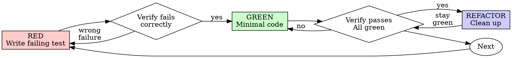

# Test-Driven Development (TDD)（测试驱动开发）

## Overview（概览）

先写 test。看它失败。再写最小 code 让它通过。

**核心原则：** 如果没有看见 test 失败，就不知道它是否真的测试了正确行为。

**违反规则的字面要求，就是违反规则精神。**

## When to Use（使用时机）

**始终使用：**

- New features
- Bug fixes
- Refactoring
- Behavior changes

**例外情况需要询问用户：**

- Throwaway prototypes
- Generated code
- Configuration files

如果你在想 “skip TDD just this once”，停下。这是 rationalization。

## Language Rules Integration（语言规则集成）

激活此 skill 时，保持 `rules-common` 作为 universal rules baseline，然后加载项目 primary language 对应的 `rules-{language}` skill（例如 Go 用 `rules-golang`，TypeScript 用 `rules-typescript`，Python 用 `rules-python`）。Language-specific rules 定义 test conventions（table-driven tests、naming patterns、framework choices），TDD cycle 中必须遵守，但不能替代 common baseline。

## The Iron Law（铁律）

```
NO PRODUCTION CODE WITHOUT A FAILING TEST FIRST
```

如果先写了 code，再写 test，删除它，重新开始。

**没有例外：**

- 不把它留作 “reference”。
- 不在写 tests 时 “adapt” 它。
- 不看它。
- Delete means delete。

从 tests 重新实现。就是这样。

## Red-Green-Refactor（红绿重构）



### RED - Write Failing Test（写失败测试）

写一个 minimal test，展示应该发生什么。

<Good>

```typescript
test('retries failed operations 3 times', async () => {
  let attempts = 0;
  const operation = () => {
    attempts++;
    if (attempts < 3) throw new Error('fail');
    return 'success';
  };

  const result = await retryOperation(operation);

  expect(result).toBe('success');
  expect(attempts).toBe(3);
});
```

名称清楚，测试真实 behavior，只测一件事。
</Good>

<Bad>

```typescript
test('retry works', async () => {
  const mock = jest.fn()
    .mockRejectedValueOnce(new Error())
    .mockRejectedValueOnce(new Error())
    .mockResolvedValueOnce('success');
  await retryOperation(mock);
  expect(mock).toHaveBeenCalledTimes(3);
});
```

名称含糊，测试 mock 而不是 code。
</Bad>

**要求：**

- One behavior。
- Clear name。
- Real code；除非不可避免，否则不用 mocks。

### Verify RED - Watch It Fail（确认失败）

**强制执行，不要跳过。**

```bash
npm test path/to/test.test.ts
```

确认：

- Test fails，不是 errors。
- Failure message 符合预期。
- 失败原因是 feature missing，不是 typo。

**Test passes?** 你在测试 existing behavior。修正 test。

**Test errors?** 修正 error，重跑直到它正确失败。

### GREEN - Minimal Code（最小实现）

写能让 test 通过的最简单 code。

<Good>

```typescript
async function retryOperation<T>(fn: () => Promise<T>): Promise<T> {
  for (let i = 0; i < 3; i++) {
    try {
      return await fn();
    } catch (e) {
      if (i === 2) throw e;
    }
  }
  throw new Error('unreachable');
}
```

刚好足以通过。
</Good>

<Bad>

```typescript
async function retryOperation<T>(
  fn: () => Promise<T>,
  options?: {
    maxRetries?: number;
    backoff?: 'linear' | 'exponential';
    onRetry?: (attempt: number) => void;
  }
): Promise<T> {
  // YAGNI
}
```

过度工程化。
</Bad>

不要添加 features、refactor other code，或超出 test 去 “improve”。

### Verify GREEN - Watch It Pass（确认通过）

**强制执行。**

```bash
npm test path/to/test.test.ts
```

确认：

- Test passes。
- Other tests still pass。
- Output pristine，没有 errors、warnings。

**Test fails?** 修 code，不修 test。

**Other tests fail?** 现在修。

### REFACTOR - Clean Up（重构清理）

只能在 green 后：

- Remove duplication。
- Improve names。
- Extract helpers。

保持 tests green。不添加 behavior。

### Repeat（重复）

为下一个 feature 写下一个 failing test。

## Good Tests（好测试）

| Quality | Good | Bad |
|---------|------|-----|
| **Minimal** | 一次一件事。Name 里有 “and”？拆开。 | `test('validates email and domain and whitespace')` |
| **Clear** | Name 描述 behavior。 | `test('test1')` |
| **Shows intent** | 展示期望 API。 | 遮蔽 code 应该做什么。 |

## Why Order Matters（为什么顺序重要）

**"I'll write tests after to verify it works"**

Code 写完后再写的 tests 会立刻通过。立刻通过什么也证明不了：

- 可能测试了 wrong thing。
- 可能测试 implementation，而不是 behavior。
- 可能漏掉你忘记的 edge cases。
- 你从未见过它捕捉 bug。

Test-first 强迫你看见 test fail，证明它真的测试了某件事。

**"I already manually tested all the edge cases"**

Manual testing 是 ad-hoc。你以为测全了，但：

- 没有记录测了什么。
- Code 改动后无法 rerun。
- 压力下容易忘 case。
- “It worked when I tried it” 不等于 comprehensive。

Automated tests 是 systematic。每次运行方式一致。

**"Deleting X hours of work is wasteful"**

这是 sunk cost fallacy。时间已经花掉了。现在的选择是：

- 删除并用 TDD 重写，花更多时间但 confidence 高。
- 保留它并事后补 tests，短期省时间但 confidence 低且容易有 bug。

真正的 waste 是保留无法信任的 code。没有 real tests 的 working code 是 technical debt。

**"TDD is dogmatic, being pragmatic means adapting"**

TDD 是 pragmatic：

- Commit 前发现 bugs，比事后 debugging 更快。
- 防止 regressions。
- 用 tests 记录 behavior。
- 支持 refactoring。

“Pragmatic” shortcuts 往往变成 production debugging，更慢。

**"Tests after achieve the same goals - it's spirit not ritual"**

不一样。Tests-after 回答 “What does this do?”；Tests-first 回答 “What should this do?”。

Tests-after 会被 implementation 偏置。你测试的是已构建内容，不一定是 required behavior。你验证的是记得的 edge cases，不是先发现的 edge cases。

Tests-first 强迫你在实现前发现 edge cases。Tests-after 只验证你记得的一切，而你不会全记得。

30 分钟事后 tests 不等于 TDD。它能给 coverage，但失去 tests work 的证明。

## Common Rationalizations（常见合理化）

| Excuse | Reality |
|--------|---------|
| "Too simple to test" | 简单 code 也会坏。Test 只要很短时间。 |
| "I'll test after" | Tests 立刻通过不能证明任何事。 |
| "Tests after achieve same goals" | Tests-after = “what does this do?”；Tests-first = “what should this do?”。 |
| "Already manually tested" | Ad-hoc 不等于 systematic。没记录，不能 rerun。 |
| "Deleting X hours is wasteful" | Sunk cost fallacy。保留 unverified code 才是 technical debt。 |
| "Keep as reference, write tests first" | 你会 adapt 它；那就是 testing after。Delete means delete。 |
| "Need to explore first" | 可以。丢弃 exploration，再从 TDD 开始。 |
| "Test hard = design unclear" | 听 test 的信号。难测通常也难用。 |
| "TDD will slow me down" | TDD 比 debugging 更快。Pragmatic = test-first。 |
| "Manual test faster" | Manual 不证明 edge cases。每次 change 都要重测。 |
| "Existing code has no tests" | 你正在改善它。给 existing code 加 tests。 |

## Red Flags - STOP and Start Over（风险信号：停止并重来）

- Code before test。
- Test after implementation。
- Test passes immediately。
- 无法解释 why test failed。
- Tests added "later"。
- Rationalizing "just this once"。
- "I already manually tested it"。
- "Tests after achieve the same purpose"。
- "It's about spirit not ritual"。
- "Keep as reference" 或 "adapt existing code"。
- "Already spent X hours, deleting is wasteful"。
- "TDD is dogmatic, I'm being pragmatic"。
- "This is different because..."。

**这些都意味着：删除 code，从 TDD 重新开始。**

## Example: Bug Fix（示例：Bug 修复）

**Bug:** Empty email accepted。

**RED**

```typescript
test('rejects empty email', async () => {
  const result = await submitForm({ email: '' });
  expect(result.error).toBe('Email required');
});
```

**Verify RED**

```bash
$ npm test
FAIL: expected 'Email required', got undefined
```

**GREEN**

```typescript
function submitForm(data: FormData) {
  if (!data.email?.trim()) {
    return { error: 'Email required' };
  }
  // ...
}
```

**Verify GREEN**

```bash
$ npm test
PASS
```

**REFACTOR**

需要时为 multiple fields 提取 validation。

## Verification Checklist（验证清单）

标记工作完成前：

- [ ] 每个 new function/method 都有 test。
- [ ] 实现前看见每个 test fail。
- [ ] 每个 test 都因 expected reason 失败：feature missing，而不是 typo。
- [ ] 写了能通过每个 test 的 minimal code。
- [ ] All tests pass。
- [ ] Output pristine，没有 errors、warnings。
- [ ] Tests 使用 real code，除非不可避免才用 mocks。
- [ ] Edge cases 和 errors 已覆盖。

不能勾选所有项？说明跳过了 TDD。重新开始。

## When Stuck（卡住时）

| Problem | Solution |
|---------|----------|
| 不知道如何 test | 写 wished-for API。先写 assertion。询问用户。 |
| Test 太复杂 | Design 太复杂。简化 interface。 |
| 必须 mock everything | Code 耦合太重。使用 dependency injection。 |
| Test setup 很大 | 提取 helpers。仍复杂？简化 design。 |

## Debugging Integration（调试集成）

发现 bug？写一个复现它的 failing test。遵循 TDD cycle。Test 证明 fix，并防止 regression。

Never fix bugs without a test。不要在没有 test 的情况下修 bug。

## Testing Anti-Patterns（测试反模式）

添加 mocks 或 test utilities 时，阅读 `testing-anti-patterns.md`，避免常见 pitfalls：

- 测试 mock behavior，而不是真实 behavior。
- 给 production classes 添加 test-only methods。
- 没理解 dependencies 就 mock。

## Final Rule（最终规则）

```
Production code → test exists and failed first
Otherwise → not TDD
```

没有用户许可，不设例外。
